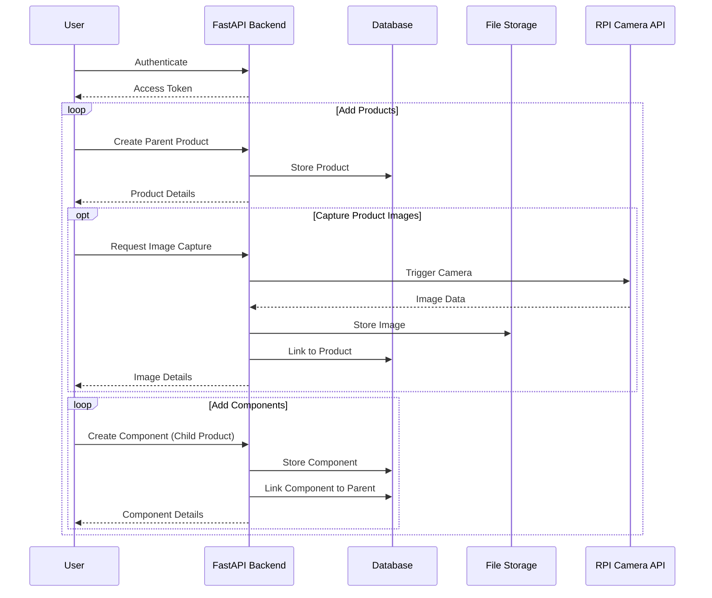

# API Structure

The platform provides a RESTful API that allows interaction with the backend services. The API is built using FastAPI and follows standard REST principles. It supports authentication, data collection, media management, and hardware integration. For complete API reference, visit the [interactive documentation](https://cml-relab.org/docs).

## Core Endpoints

### Authentication

- `/auth/*` - Login, logout, OAuth, and user management

### Data Collection

- `/products` - Products and components

### Reference Data

- `/background-data/*` - Taxonomies, categories, materials, product types

### Media Management

- `/file-storage/*` - Images, videos, and file uploads

### Hardware Integration

- `/plugins/rpi-cam/*` - Raspberry Pi camera control and streaming

## Interaction flow diagram

