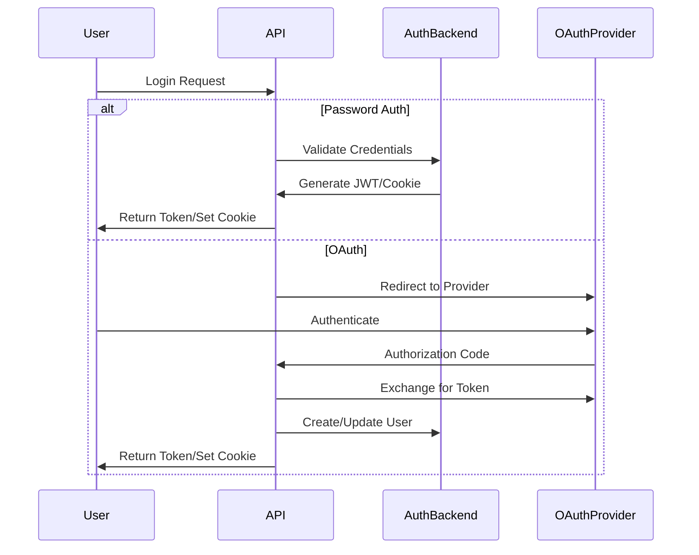

# Authentication

The authentication system uses [FastAPI-Users](https://fastapi-users.github.io/fastapi-users/latest/) with support for both bearer token and cookie-based authentication. It also supports OAuth integration for Google and GitHub accounts.

For an overview of the relevant API endpoints, visit the [interactive documentation](https://api.cml-relab.org/docs#tag/auth).
