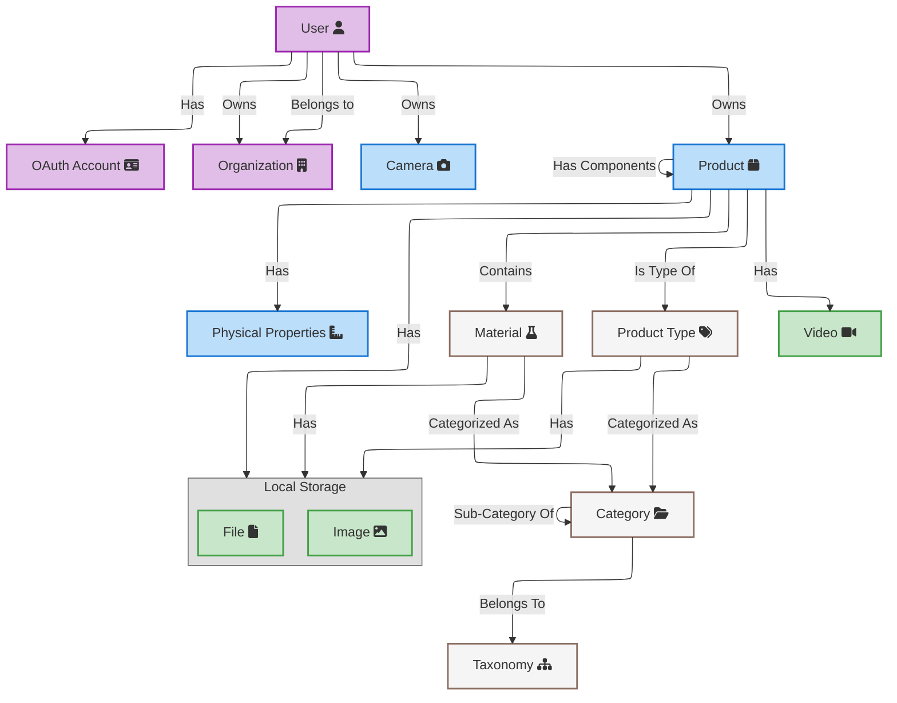
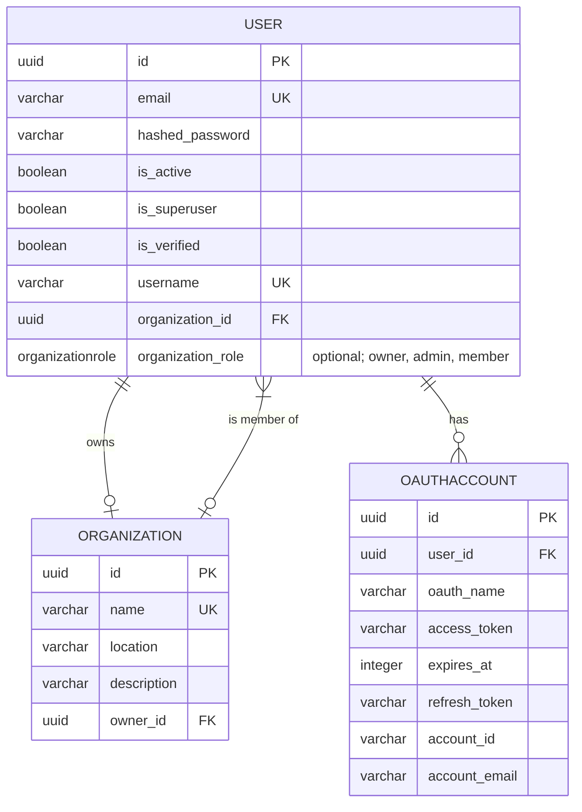
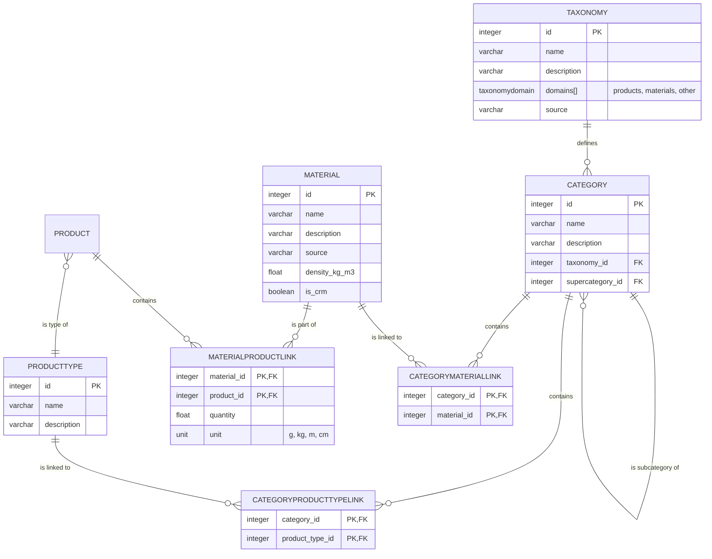
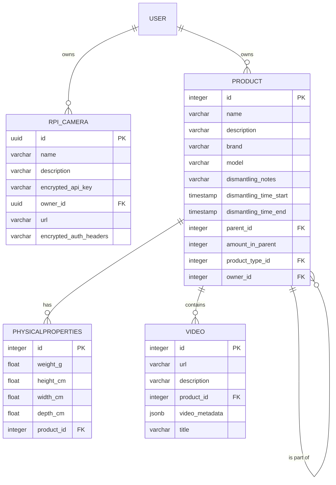
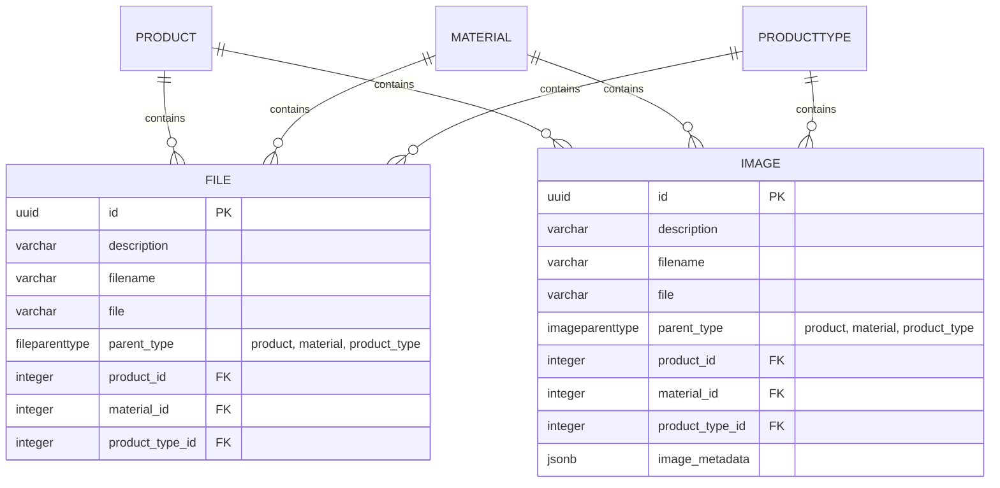

# Data Model Overview

The Reverse Engineering Lab platform uses a relational database to manage users, products, and background data. A simplified overview of the full database schema is provided below, along with detailed explanations of each module.

The full data schema is broken up into four modules: user management, background data management, data collection, and file storage.

## User management

The user management module handles user accounts, organizations, and OAuth account associations.

## Background data management

The background data management module handles taxonomies, categories, materials, and product types. It allows for flexible categorization and linking of materials to products.

## Data collection

The data collection module manages disassembly sessions, products, and their properties.

## File storage

The file storage module handles files and images associated with products, materials, and product types. It supports polymorphic associations to allow files to be linked to different parent types. Videos are currently not stored in the database but can be linked via URLs.

