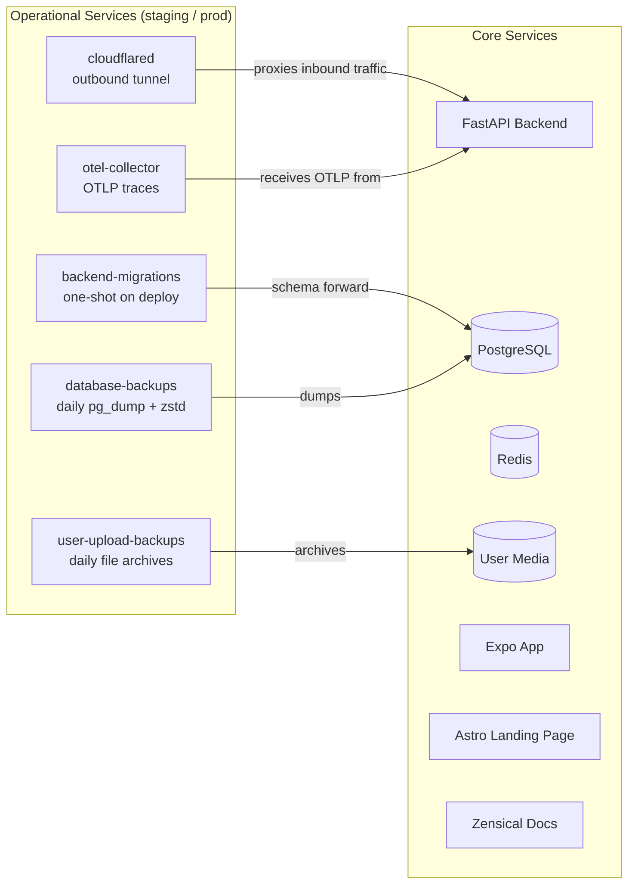

# Deployment and Operations

The platform runs as a self-hosted Docker Compose stack. It is intentionally simple: understandable, reproducible, and cheap to operate at PhD-project scale.

## Compose Service Topology

The deployed stack is defined entirely in Docker Compose. Core services run in all environments; operational services are layered on top in staging and production, some via Compose profiles.

Backup services and the OpenTelemetry collector are activated via Compose profiles (`backups`, `telemetry`) so they can be started independently without restarting the core stack.

For formal architecture views of the platform as a whole, see [C4 Architecture Diagrams](c4-diagrams.md).

## Storage and Backups

- PostgreSQL stores the primary application state.
- Uploaded files and images are stored on disk and served by the backend.
- Database dumps and user-uploaded files are backed up regularly to cloud storage.
- Alembic migrations move schema state forward in a controlled way.

## Quality Controls

- backend: unit and integration tests, linting, and type checking
- frontend-app: Jest tests for app logic and UI components
- frontend-web: Vitest and Playwright coverage for the public site
- docs: formatting, spelling checks, and build smoke tests

The repository also includes dependency maintenance and repository-level checks. Deployment is still largely manual.

## Operational Considerations

- Redis is used both for caching and parts of the authentication and token flow. Partial Redis outages have user-facing effects.
- Uploaded media is part of the research record and should be treated as primary data, not as disposable assets.
- Production secrets and origin/host configuration matter; the backend enforces stricter checks outside development.
- Tracing is optional. When enabled, the backend exports OTLP traces to a local or external collector.
- The Compose-based setup is easy to reason about, but scaling and secret rotation are less automated than in a larger platform setup. That trade-off is deliberate.
