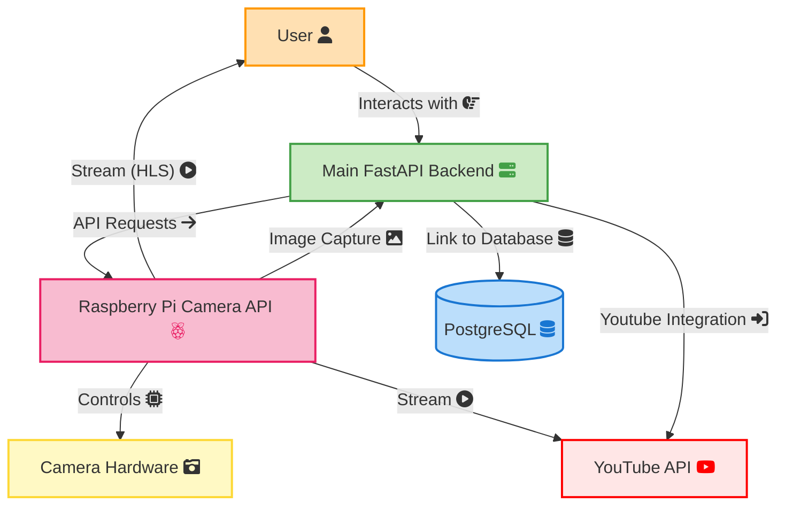
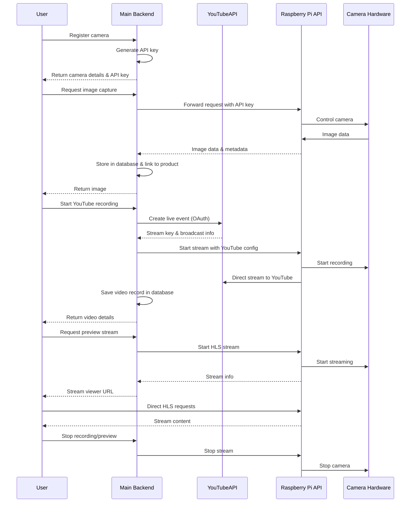

# Raspberry Pi Camera Plugin Architecture

The Raspberry Pi Camera Plugin enables integration between Raspberry Pi devices with cameras and the CML Reverse Engineering Lab platform. It provides a REST API for remote camera control, image capture, and video streaming to YouTube. See the [Raspberry Pi Camera Plugin User Guide](../user-guides/rpi-cam.md) for more details.

## System diagram

## Interaction flow diagram

