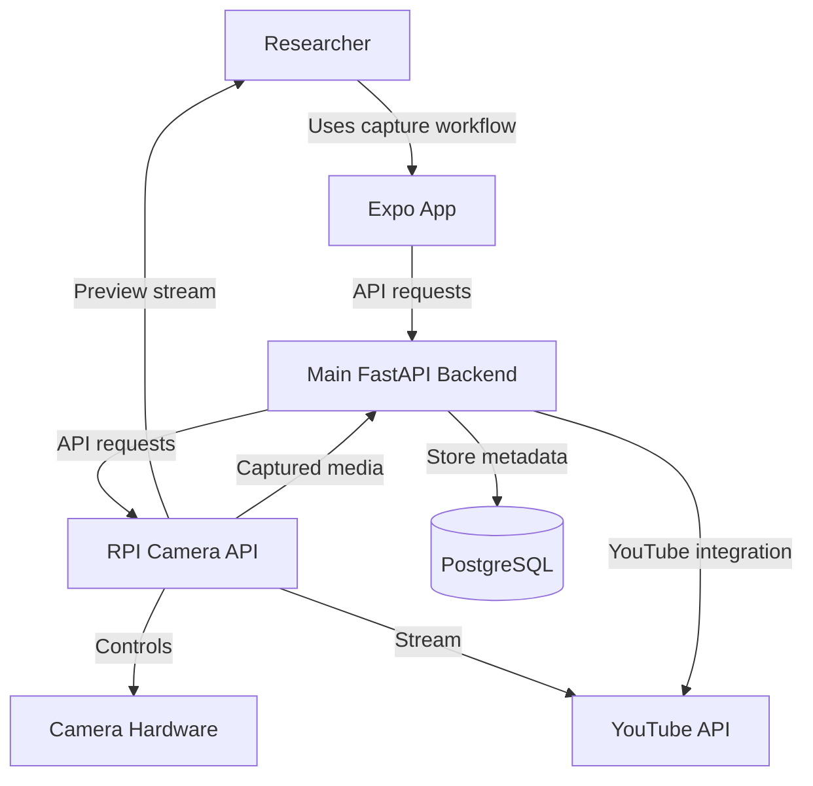
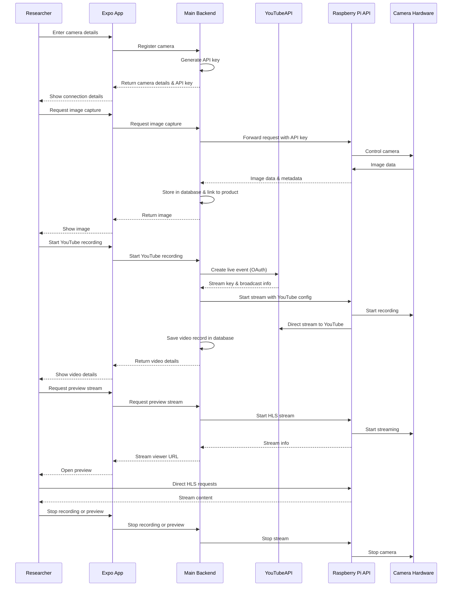

# RPI Camera Plugin Architecture

An optional plugin that connects camera devices to RELab for remote capture, HLS preview streaming, and YouTube streaming. The backend acts as a proxy; the Expo app never talks to the device directly.

For platform-side setup and day-to-day usage, see the [RPI Camera User Guide](../user-guides/rpi-cam.md). For device installation and deployment, see the [RPI Camera Plugin repository](https://github.com/CMLPlatform/relab-rpi-cam-plugin).

## System Diagram

```mermaid
graph TD
    Researcher[Researcher] -->|Uses capture workflow| FrontendApp[Expo App]
    FrontendApp -->|API requests| MainAPI[Main FastAPI Backend]

    MainAPI -->|API requests| RpiCamAPI[RPI Camera API]
    RpiCamAPI -->|Controls| Camera[Camera Hardware]

    RpiCamAPI -->|Preview stream| Researcher
    RpiCamAPI -->|Stream| YouTube[YouTube API]
    RpiCamAPI -->|Captured media| MainAPI
    MainAPI -->|YouTube integration| YouTube

    MainAPI -->|Store metadata| Database[(PostgreSQL)]
```

## Interaction Flow

```mermaid
sequenceDiagram
    participant Researcher
    participant App as Expo App
    participant Backend as Main Backend
    participant YouTubeAPI
    participant RPiCamAPI as Raspberry Pi API
    participant Camera as Camera Hardware

    %% Camera Registration
    Researcher->>App: Enter camera details
    App->>Backend: Register camera
    Backend->>Backend: Generate API key
    Backend-->>App: Return camera details & API key
    App-->>Researcher: Show connection details

    %% Image Capture Flow
    Researcher->>App: Request image capture
    App->>Backend: Request image capture
    Backend->>RPiCamAPI: Forward request with API key
    RPiCamAPI->>Camera: Control camera
    Camera->>RPiCamAPI: Image data
    RPiCamAPI-->>Backend: Image data & metadata
    Backend->>Backend: Store in database & link to product
    Backend-->>App: Return image
    App-->>Researcher: Show image

    %% YouTube Streaming Flow
    Researcher->>App: Start YouTube recording
    App->>Backend: Start YouTube recording
    Backend->>YouTubeAPI: Create live event (OAuth)
    YouTubeAPI-->>Backend: Stream key & broadcast info
    Backend->>RPiCamAPI: Start stream with YouTube config
    RPiCamAPI->>Camera: Start recording
    RPiCamAPI->>YouTubeAPI: Direct stream to YouTube
    Backend->>Backend: Save video record in database
    Backend-->>App: Return video details
    App-->>Researcher: Show video details

    %% Local Preview Stream
    Researcher->>App: Request preview stream
    App->>Backend: Request preview stream
    Backend->>RPiCamAPI: Start HLS stream
    RPiCamAPI->>Camera: Start streaming
    RPiCamAPI-->>Backend: Stream info
    Backend-->>App: Stream viewer URL
    App-->>Researcher: Open preview
    Researcher->>RPiCamAPI: Direct HLS requests
    RPiCamAPI-->>Researcher: Stream content

    %% Stop Streaming
    Researcher->>App: Stop recording or preview
    App->>Backend: Stop recording or preview
    Backend->>RPiCamAPI: Stop stream
    RPiCamAPI->>Camera: Stop camera
```

## Key Design Decisions

- **Backend as proxy**: All device communication goes through the main backend. The Expo app never contacts the camera directly, keeping auth and storage centralised.
- **API key per camera**: Each registered camera receives a unique key. The device uses this to authenticate inbound requests from the backend.
- **Media storage**: Captured images are stored in RELab's file storage and linked to the originating product or component record automatically.
- **Optional YouTube integration**: Streaming is mediated through the backend's OAuth connection to YouTube. The device streams directly to YouTube once authorised.
