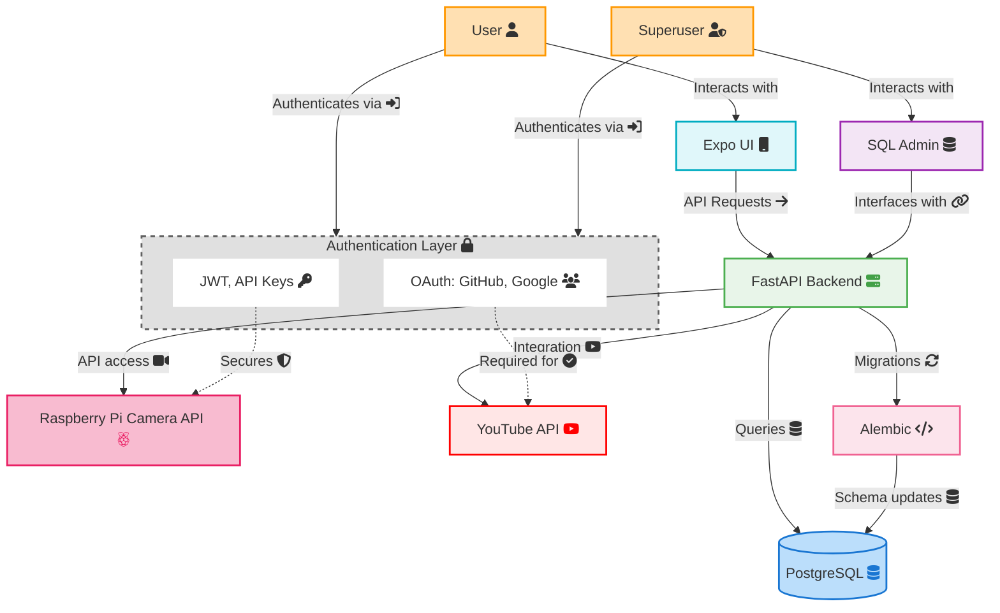

# System Design

The Reverse Engineering Lab platform is designed as a modular application for collecting, categorizing, and analyzing disassembled durable goods data to support circular economy research and computer vision applications.

## High-Level Architecture



## Technology Stack

- **Backend**: [FastAPI](https://fastapi.tiangolo.com/)
- **Admin interface**: [SQLAdmin](https://github.com/aminalaee/sqladmin)
- **ORM layer**: [SQLModel](https://github.com/fastapi/sqlmodel)
- **Migrations**: [Alembic](https://alembic.sqlalchemy.org/en/latest/)
- **Database**: [PostgreSQL](https://www.postgresql.org/)
- **Frontend**: [Expo](https://docs.expo.dev/) (planned)
- **Machine learning**: [PyTorch](https://pytorch.org/) (planned)

## Backend Application Structure

The backend application follows a modular structure organized by domain-specific components:

```sh
app/
├── api/                  # API modules
│   ├── admin/            # Admin interface
│   ├── auth/             # Authentication
│   ├── background_data/  # Taxonomies, materials, product types
│   ├── common/           # Shared utilities
│   ├── data_collection/  # Products and components
│   ├── file_storage/     # File and image handling
│   └── plugins/          # Plugin modules (e.g., rpi_cam)
├── core/                 # Core application modules
│   ├── config.py         # Configuration settings
│   ├── database.py       # Database connection
│   └── utils/            # Core utilities
├── static/               # Static files
└── templates/            # HTML templates
```
