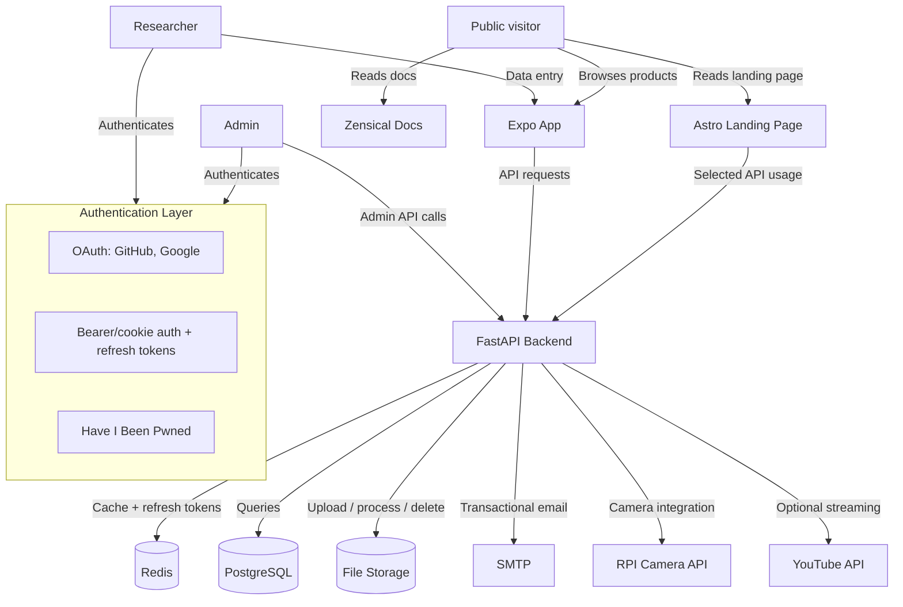
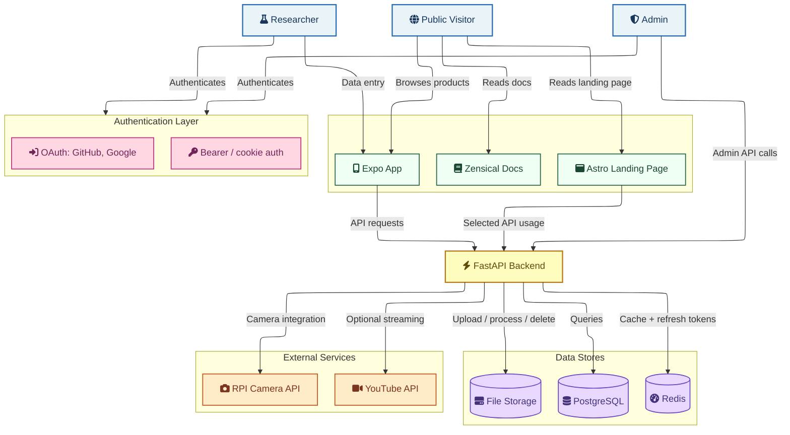

# System Design

<div class="relab-section-intro">
RELab is split into a research app, a public website, and backend services so each part can evolve without forcing every workflow into one interface.
</div>

This structure follows the broader research goal of the platform: generate product-level observations through practical data collection workflows, make them publicly viewable and reusable, and keep the system open enough to link with other data infrastructures later.

## High-Level Architecture


```mermaid
graph TD
    Researcher[Researcher] -->|Data entry| FrontendApp[Expo App]
    PublicUser[Public visitor] -->|Browses products| FrontendApp
    PublicUser -->|Reads landing page| FrontendWeb[Astro Landing Page]
    PublicUser -->|Reads docs| Docs[Zensical Docs]
    Admin[Admin] -->|Admin API calls| Backend[FastAPI Backend]

    FrontendApp -->|API requests| Backend
    FrontendWeb -->|Selected API usage| Backend
    Backend -->|Cache + refresh tokens| Redis[(Redis)]
    Backend -->|Queries| PostgreSQL[(PostgreSQL)]
    Backend -->|Upload / process / delete| FileStorage[(File Storage)]
    Backend -->|Transactional email| SMTP[SMTP]

    subgraph AuthenticationLayer [Authentication Layer]
        OAuthProviders[OAuth: GitHub, Google]
        AuthSystem[Bearer/cookie auth + refresh tokens]
        HIBP[Have I Been Pwned]
    end

    Researcher -->|Authenticates| AuthenticationLayer
    Admin -->|Authenticates| AuthenticationLayer

    Backend -->|Camera integration| RaspberryPi[RPI Camera API]
    Backend -->|Optional streaming| YouTube[YouTube API]
```

??? info "Styled architecture overview (ELK layout)"

````

```mermaid
---
config:
    layout: elk
    elk:
        nodePlacementStrategy: LINEAR_SEGMENTS
---
graph TD
    Researcher["fa:fa-flask Researcher"] -->|Data entry| FrontendApp
    PublicUser["fa:fa-globe Public Visitor"] -->|Browses products| FrontendApp
    PublicUser -->|Reads landing page| FrontendWeb
    PublicUser -->|Reads docs| Docs
    Admin["fa:fa-shield-halved Admin"] -->|Admin API calls| Backend

    subgraph Frontends [" "]
        FrontendApp["fa:fa-mobile-screen Expo App"]
        FrontendWeb["fa:fa-window-maximize Astro Landing Page"]
        Docs["fa:fa-book Zensical Docs"]
    end

    FrontendApp -->|API requests| Backend
    FrontendWeb -->|Selected API usage| Backend

    Backend["fa:fa-bolt FastAPI Backend"]

    subgraph DataStores ["Data Stores"]
        Redis[("fa:fa-gauge-high Redis")]
        PostgreSQL[("fa:fa-database PostgreSQL")]
        FileStorage[("fa:fa-hard-drive File Storage")]
    end

    Backend -->|Cache + refresh tokens| Redis
    Backend -->|Queries| PostgreSQL
    Backend -->|Upload / process / delete| FileStorage

    subgraph Auth ["Authentication Layer"]
        OAuthProviders["fa:fa-right-to-bracket OAuth: GitHub, Google"]
        AuthSystem["fa:fa-key Bearer / cookie auth"]
    end

    Researcher -->|Authenticates| Auth
    Admin -->|Authenticates| Auth

    subgraph External ["External Services"]
        RaspberryPi["fa:fa-camera RPI Camera API"]
        YouTube["fa:fa-video YouTube API"]
    end

    Backend -->|Camera integration| RaspberryPi
    Backend -->|Optional streaming| YouTube

    classDef actor fill:#e8f4f8,stroke:#2b6cb0,stroke-width:2px,color:#1a365d
    classDef frontend fill:#f0fff4,stroke:#276749,stroke-width:1.5px,color:#1a4731
    classDef backend fill:#fefcbf,stroke:#b7791f,stroke-width:2px,color:#5f4b0a
    classDef datastore fill:#e9d8fd,stroke:#6b46c1,stroke-width:1.5px,color:#44337a
    classDef auth fill:#fed7e2,stroke:#b83280,stroke-width:1.5px,color:#702459
    classDef external fill:#feebc8,stroke:#c05621,stroke-width:1.5px,color:#7b341e

    class Researcher,PublicUser,Admin actor
    class FrontendApp,FrontendWeb,Docs frontend
    class Backend backend
    class Redis,PostgreSQL,FileStorage datastore
    class OAuthProviders,AuthSystem,HIBP auth
    class SMTP,RaspberryPi,YouTube external
```
````

For formal C4 architecture views (Context, Container, Component), see [C4 Architecture Diagrams](c4-diagrams.md).

## Monorepo Structure

- `backend/`: main API, persistence, auth, file handling, and plugin integration
- `frontend-app/`: authenticated mobile-first data collection client built with Expo Router
- `frontend-web/`: landing page built with Astro
- `docs/`: documentation site
- Compose files at the repository root coordinate local and deployed multi-service setups

## Technology Choices

- **Backend API**: FastAPI
- **Persistence layer**: SQLModel and SQLAlchemy
- **Database**: PostgreSQL
- **Migrations**: Alembic
- **Caching and token infrastructure**: Redis
- **Research app frontend**: Expo / React Native
- **Public web frontend**: Astro
- **Docs site**: Zensical

These choices keep the stack relatively small and understandable, while still supporting public access, API interoperability, and later AI-assisted workflows.

## Backend Domain Structure

The backend is organised mainly by domain rather than by HTTP verb alone:

```sh
app/
├── api/
│   ├── auth/             # Login, registration, OAuth, users, organizations
│   ├── background_data/  # Taxonomies, categories, materials, product types, units
│   ├── data_collection/  # Products, components, search, related properties
│   ├── file_storage/     # Uploaded files, images, linked media records
│   ├── newsletter/       # Newsletter subscription flows
│   ├── plugins/          # Optional integrations such as rpi_cam
│   └── common/           # Shared routers, helpers, exceptions
├── core/                 # Runtime configuration, DB, cache, logging, HTTP clients
├── static/               # Static assets served by the backend
└── templates/            # Email and HTML templates
```

## Runtime Behavior

At startup the backend:

- validates security-sensitive configuration
- initializes Redis and API caching
- creates storage directories for uploads
- mounts static and upload-backed routes
- prepares shared outbound HTTP clients
- starts background cleanup infrastructure

## Design Priorities

- keep the data model explicit and inspectable
- support authenticated data entry from a dedicated app
- allow public and private API surfaces to coexist
- preserve a path toward dataset publication and external reuse
- support FAIR-style reuse through open interfaces and documented structure
- keep the data model suitable for later benchmarking and AI-assisted enrichment
- avoid unnecessary infrastructure complexity for a PhD-scale project
