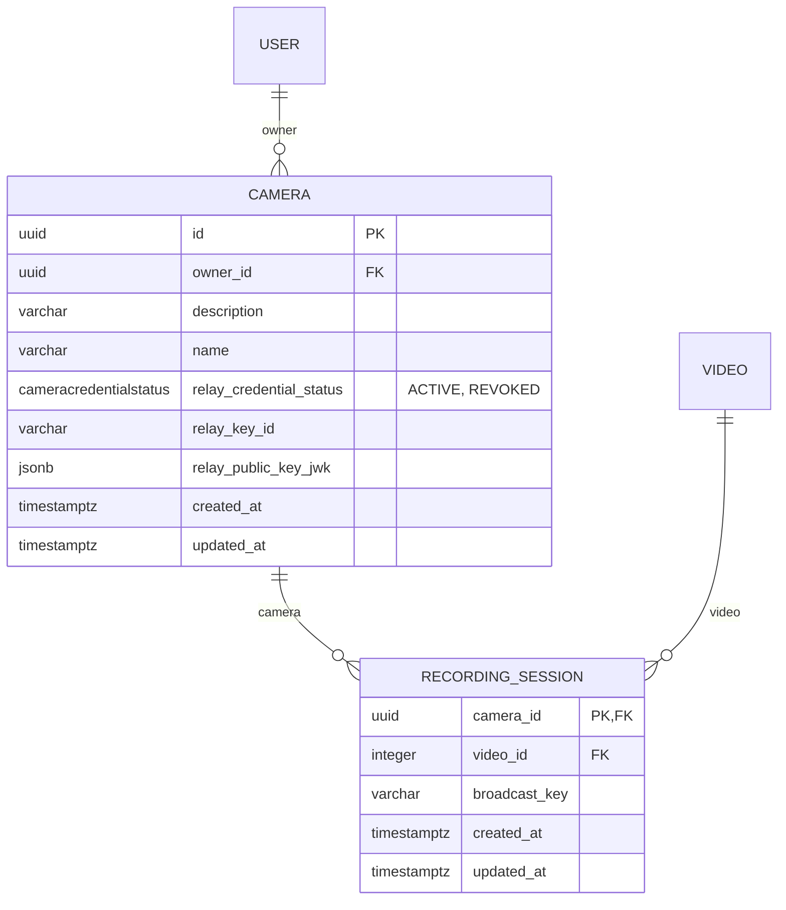

{/* Generated by backend/scripts/generate/export_datamodel.py. Do not edit. */}

```mermaid
erDiagram
    accTitle: Camera plugin entities
    accDescr: The camera plugin tables are CAMERA, RECORDING_SESSION. Each CAMERA row names exactly one USER as its owner. Each RECORDING_SESSION row names exactly one CAMERA as its camera. Each RECORDING_SESSION row names exactly one VIDEO as its video.

    CAMERA {
        uuid id PK
        uuid owner_id FK
        varchar description
        varchar name
        cameracredentialstatus relay_credential_status "ACTIVE, REVOKED"
        varchar relay_key_id
        jsonb relay_public_key_jwk
        timestamptz created_at
        timestamptz updated_at
    }

    RECORDING_SESSION {
        uuid camera_id PK, FK
        integer video_id FK
        varchar broadcast_key
        timestamptz created_at
        timestamptz updated_at
    }

    USER ||--o{ CAMERA : "owner"
    CAMERA ||--o{ RECORDING_SESSION : "camera"
    VIDEO ||--o{ RECORDING_SESSION : "video"
```
