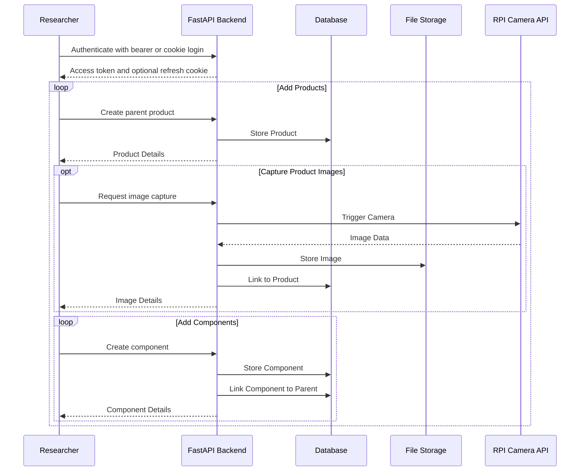

Routes are organised by domain, not by HTTP verb. The same API serves the research app, the public web frontend, and external tooling. Public and authenticated surfaces are separated in practice, but the cleanest source of truth is the live OpenAPI docs.

For the live schema and request models, use the [interactive API documentation](https://api.cml-relab.org/docs). For practical usage guidance, see the [API interaction guide](../../user-guides/api/).

## Route organisation

### Authentication and user management

- `/v1/auth/*` — login, logout, refresh, registration, verification, and password reset
- `/v1/oauth/*` — Google, GitHub, and YouTube account authorization, callbacks, token exchange, and account linking
- `/v1/users/*` — authenticated user self-management
- `/v1/profiles/{username}` — username-addressed public profile reads
- `/v1/admin/users/*` — superuser user administration

### Data collection

- `/v1/products/*` — base-product creation, reads, updates, search, owner filters, base-product media, videos, bill-of-materials, and parent-scoped component lists
- `/v1/components/*` — stable component reads, updates, component-scoped media, and component bill-of-materials
- `/v1/products?owner=me` and `/v1/users/{user_id}/products/*` — user-scoped product access

### Reference data

- public `/v1/taxonomies`, `/v1/categories`, `/v1/materials`, `/v1/product-types`, and `/v1/units` endpoints for reference lookups
- `/v1/admin/*` variants for controlled management of reference data

### Media

- image/file payloads expose generated `/uploads/*` media URLs, including precomputed thumbnails when available
- base-product media remains under `/v1/products/{id}/images` and `/v1/products/{id}/files`
- component media uses `/v1/components/{id}/images` and `/v1/components/{id}/files`
- hyperspectral datasets use file routes, not image routes, so raw ENVI, HDF5, NITF, and GeoTIFF data is stored without image rewriting
- videos are base-product-only under `/v1/products/{id}/videos`

## Product and component resources

Base products and components share the same database table, but they are separate API resources:

- base products are addressed through `/v1/products/{id}`
- components are addressed through `/v1/components/{id}`
- new components are created in parent context: use `POST /v1/products/{id}/components` for a base-product parent and `POST /v1/components/{id}/components` for a component parent
- direct children and bounded base-product subtrees are listed with `/v1/products/{id}/components` and `/v1/products/{id}/components/tree`
- bill-of-materials routes follow the addressed resource: `/v1/products/{id}/materials` for base products and `/v1/components/{id}/materials` for components

Owner attribution is viewer-aware. Public profiles show product owner names to everyone, community profiles show them only to signed-in users, and private profiles show them only to the owner and admins. Hidden owner identity is returned as `null` rather than exposing a username or owner id.

### Hardware integration

- `/v1/plugins/rpi-cam/*` — camera registration, status, capture, streaming, and remote interactions

### Supporting services

- health and readiness endpoints for deployment checks

## Design notes

- The backend serves both browser-oriented and app-oriented clients.
- Authentication supports both cookie and bearer transports (see [Authentication](../auth/)).
- Public reference data is openly accessible; user-owned research data requires authentication.

## Example interaction flow

