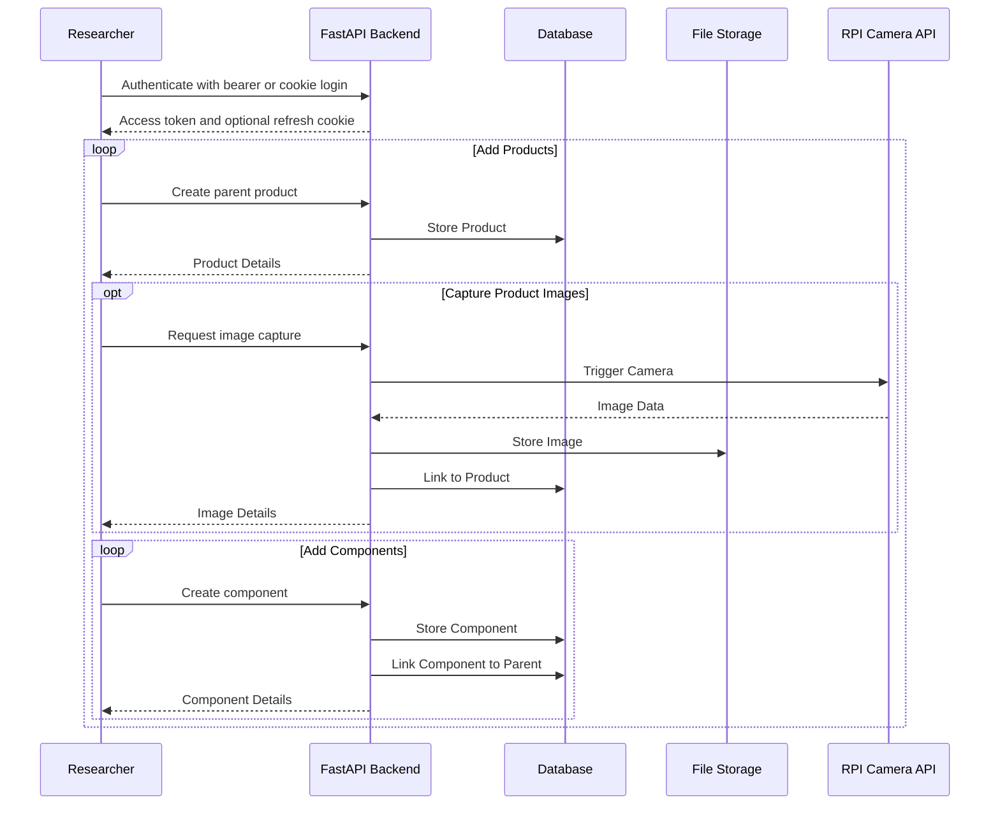

Routes are organised by domain, not by HTTP verb. The same API serves the research app, the public web frontend, and external tooling.

The RELab backend exposes a REST-style API used by the Expo app, the public web frontend, and selected operational tooling. Public and authenticated surfaces are separated in practice, but the cleanest source of truth is the live OpenAPI docs.

For the live schema and request models, use the [interactive API documentation](https://api.cml-relab.org/docs). For practical usage guidance, see the [API Interaction Guide](../../user-guides/api/).

## Route Organisation

### Authentication & User Management

- `/auth/*` — login, logout, refresh, registration, verification, password reset, and OAuth
- `/users/*` and `/organizations/*` — authenticated user and organization operations
- `/admin/users/*` and `/admin/organizations/*` — superuser administration

### Data Collection

- `/products/*` — product creation, reads, updates, search, and parent-child component relations
- `/users/me/products/*` and `/users/{user_id}/products/*` — user-scoped product access

### Reference Data

- public `/taxonomies`, `/categories`, `/materials`, `/product-types`, and `/units` endpoints for reference lookups
- `/admin/*` variants for controlled management of background data

### Media

- `/images/*` and related file-storage endpoints for uploads, linked media, and retrieval

### Hardware Integration

- `/plugins/rpi-cam/*` — camera registration, status, capture, streaming, and remote interactions

### Supporting Services

- `/newsletter/*` — newsletter subscription operations
- health and readiness endpoints for deployment checks

## Design Notes

- The backend serves both browser-oriented and app-oriented clients.
- Authentication supports both cookie and bearer transports (see [Authentication](../auth/)).
- Public reference data is openly accessible; user-owned research data requires authentication.

## Example Interaction Flow

