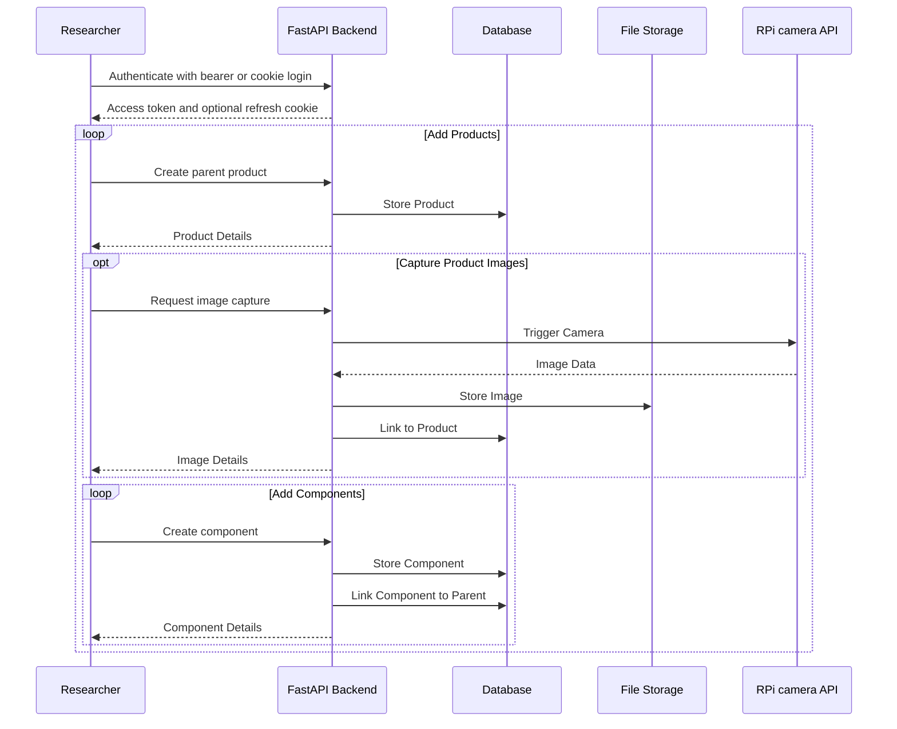

Routes are organized by domain. One API serves the research app, the public web frontend, and external tooling. The live OpenAPI docs are the source of truth: see the [API reference overview](/api-reference/) for schemas and the [API interaction guide](../../user-guides/api/) for usage.

Three surfaces: the public app API is the contract for the frontend and external clients, the device API handles Pi-originated HTTP callbacks, and a small private DTO seam covers backend device integration plus the RPi camera plugin.

## Route organization

### Authentication and user management

- `/v1/auth/*` — login, logout, refresh, registration, verification, password reset, and TOTP MFA setup/challenge flows
- `/v1/oauth/*` — Google, GitHub, and YouTube account authorization, callbacks, token exchange, and account linking
- `/v1/users/*` — authenticated user self-management
- `/v1/profiles/{username}` — username-addressed public profile reads
- `/v1/admin/users/*` — superuser user administration

### Data collection

- `/v1/products/*` — base-product creation, reads, updates, search, owner filters, base-product media, videos, bill-of-materials, and parent-scoped component lists
- `/v1/products/facets` and `/v1/products/suggestions/*` — filter facets and brand/model autocomplete suggestions for product search
- `/v1/components/*` — stable component reads, updates, component-scoped media, and component bill-of-materials
- `/v1/products?owner=me` and `/v1/users/{user_id}/products/*` — user-scoped product access

### Reference data

- public `/v1/taxonomies`, `/v1/categories`, `/v1/materials`, `/v1/product-types`, and `/v1/units` endpoints for reference lookups
- `/v1/admin/*` variants for controlled management of reference data

### Statistics

- `/v1/stats/totals`, `/v1/stats/series`, and `/v1/stats/categories` — aggregate public totals, time series, and category breakdowns for dashboards and reporting

### Media

- image/file payloads expose generated `/uploads/*` media URLs, including precomputed thumbnails when available
- base-product media remains under `/v1/products/{id}/images` and `/v1/products/{id}/files`
- component media uses `/v1/components/{id}/images` and `/v1/components/{id}/files`
- hyperspectral datasets use file routes, not image routes, so raw ENVI, HDF5, NITF, and GeoTIFF data is stored without image rewriting
- videos are base-product-only under `/v1/products/{id}/videos`

## Product and component resources

Base products and components share the same database table, but they are separate API resources:

- base products are addressed through `/v1/products/{id}`
- components are addressed through `/v1/components/{id}`
- new components are created in parent context: use `POST /v1/products/{id}/components` for a base-product parent and `POST /v1/components/{id}/components` for a component parent
- direct children and bounded base-product subtrees are listed with `/v1/products/{id}/components` and `/v1/products/{id}/components/tree`
- bill-of-materials routes follow the addressed resource: `/v1/products/{id}/materials` for base products and `/v1/components/{id}/materials` for components

Entry is progressive: a record can be created before its component tree or bill of materials is known. Completeness checks belong to later curation and audit, not create-time validation.

Create requests (`POST /v1/products`, `POST /v1/products/{id}/components`, `POST /v1/components/{id}/components`) accept an optional `Idempotency-Key` header, so a client can retry a request whose response was lost after the server committed it. A retry with the same key returns the original response instead of creating a duplicate.

A key is replayed only when the retry matches the original:

- the same authenticated user
- the same target, including the parent id: the same key on `POST /v1/products/1/components` and `POST /v1/products/2/components` are two separate requests
- the same request body; a different payload returns `422`

A retry that arrives while the first request is still running returns `409`. If the idempotency store is unreachable, the request fails closed with `503`. Stored responses expire after one hour.

Owner attribution is viewer-aware. Public profiles show product owner names to everyone, community profiles only to signed-in users, and private profiles only to the owner and admins. Hidden owner identity is returned as `null`.

### Hardware integration

- `/v1/plugins/rpi-cam/*` — camera registration, status, capture, streaming, and remote interactions

The app-facing camera routes appear in the [public API reference](/api/public/). Pairing and Pi-originated callbacks appear in the [device API reference](/api/device/). The separate local camera API served by the plugin appears in the [RPi camera API reference](/api/rpi-cam/).

### Supporting services

- health and readiness endpoints for deployment checks

## Design notes

- The backend serves both browser-oriented and app-oriented clients.
- Authentication supports both cookie and bearer transports (see [Authentication](../auth/)).
- Public reference data and research reads are open. User-owned workflows require authentication; backend dependencies limit mutations to verified owners or superusers.

## Example interaction flow

```mermaid
sequenceDiagram
    accTitle: Example product and image capture interaction flow
    accDescr: A researcher authenticates with the API, then repeatedly creates products, optionally requests an image capture that the API relays through the RPi camera API and stores in file storage, and adds components linked to the parent product.
    participant Researcher
    participant API as FastAPI Backend
    participant DB as Database
    participant Storage as File Storage
    participant RPI as RPi camera API

    Researcher->>API: Authenticate with bearer or cookie login
    API-->>Researcher: Access token and optional refresh cookie

    loop Add Products
        Researcher->>API: Create parent product
        API->>DB: Store Product
        API-->>Researcher: Product Details

        opt Capture Product Images
            Researcher->>API: Request image capture
            API->>RPI: Trigger Camera
            RPI-->>API: Image Data
            API->>Storage: Store Image
            API->>DB: Link to Product
            API-->>Researcher: Image Details
        end

        loop Add Components
            Researcher->>API: Create component
            API->>DB: Store Component
            API->>DB: Link Component to Parent
            API-->>Researcher: Component Details
        end
    end
```
