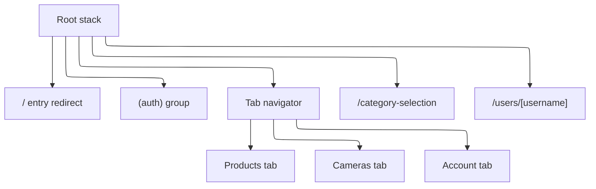
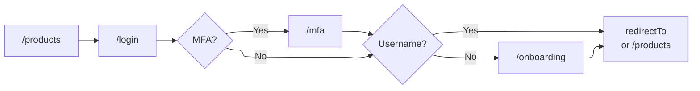
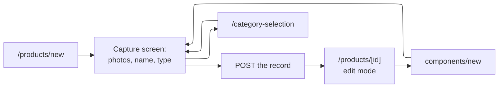

Which screens the Expo app has, how they nest, and what moves a person between them. This page
is for maintainers changing routing, auth gating, or the record-creation path. For how to
*use* the app, see [Getting started](/user-guides/getting-started/) and
[Data collection](/user-guides/data-collection/).

The source layout behind these routes is documented in `app/ARCHITECTURE.md`.

## Screen map

Routes live in `app/src/app/` as an Expo Router file tree. Segments in parentheses are groups:
they organize the tree without appearing in the URL, so `(tabs)/(products)/products/index.tsx`
is served at `/products`.

| Route | What it is |
| ----- | ---------- |
| `/` | Entry redirect. Renders nothing and sends you to `/products`. |
| `/login` | Password and OAuth sign-in. Accepts a `redirectTo` parameter. |
| `/new-account` | Password registration. |
| `/forgot-password`, `/reset-password` | Password reset request and completion. |
| `/mfa` | Second factor, reached only from a sign-in that needs one. |
| `/verify` | Email verification landing page, opened from a link. |
| `/onboarding` | Username choice, for accounts created without one. |
| `/products` | Product list. The app's home. |
| `/products/new` | Capture screen for a new top-level product. |
| `/products/[id]` | Product detail, also the edit surface. |
| `/products/[id]/components/new` | Capture screen for a component of that product. |
| `/components/[id]` | Component detail. Same screen family as a product. |
| `/components/[id]/components/new` | Capture screen for a nested component. |
| `/cameras` | Paired camera list. |
| `/cameras/add` | Pairing a new Raspberry Pi camera. |
| `/cameras/[id]` | Camera detail, live view and streaming controls. |
| `/account` | The signed-in account: profile, preferences, integrations, sign-out. |
| `/category-selection` | Category and product-type picker. Presents over whichever screen opened it. |
| `/users/[username]` | Public contributor profile. |

Three things about that tree are load-bearing rather than incidental:

- **Each tab is a group holding its own Stack.** A tab keeps its navigation trail while you are
  on another one, which is why `(products)`, `(cameras)` and `(account)` are groups rather than
  plain screens.
- **The products tab owns both `/products` and `/components`.** A component is a product's
  child, and cards, breadcrumbs and post-create redirects hop between the two constantly.
  Splitting them across navigators would make every hop a cross-navigator replace.
- **`/category-selection` and `/users/[username]` sit on the root stack, not in a tab.** They
  are reachable from more than one tab and should not join any single tab's trail.

The cameras destination is hidden for accounts with the Raspberry Pi integration switched off.
The tab itself still exists; only the navigation chrome filters it, through
`useVisibleDestinations` in `src/navigation/destinations.ts`.

## Getting in

Nothing in the app is gated behind a splash or a login wall. `/` redirects to `/products`, and
the product list renders for signed-out visitors. Authentication is demanded per action, not up
front.

**The auth gate** is `useRequireAuth(redirectTo)`. It replaces the current route with
`/login`, carrying the caller's own path as `redirectTo` so the person lands back where they
were trying to go. It waits on three conditions before firing, each of which caused a real bug:
it holds while the session is still being restored, so a slow restore cannot flash a signed-in
user to the login screen; it fires only for the focused screen, because tab groups keep screens
mounted off-focus and an unfocused screen would otherwise redirect out from under the one you
are looking at; and it holds during sign-out.

**`redirectTo` is validated, not trusted.** `getSafeRedirectTarget` accepts only a path
beginning with a single `/`, and re-resolves it to confirm it cannot escape the app's origin.
Anything else — an absolute URL, a protocol-relative `//host` — is dropped and the sign-in falls
back to `/products`. Treat that function as the boundary: a new caller passing a
`redirectTo` from anywhere external must go through it.

**Onboarding is enforced in two places, deliberately.** `routeAuthenticatedUser` sends a fresh
sign-in to `/onboarding` when the account has no username, and a root-level effect in
`_layout.tsx` re-checks on every path change. The second one exists because an account can
reach a signed-in state without passing through the sign-in screen — an OAuth callback, or a
restored session — and the username is required before the account can own records. The same
effect bounces you off `/onboarding` once a username exists, so the screen cannot be revisited.

## Recording a product

Record creation is capture-first: photograph and name the thing, save it immediately, then fill
in detail on the record that now exists. The alternative — a long form that only becomes a
record on submit — loses work when a lab session gets interrupted.

The transition into the detail screen is a `replace`, not a `push`: the capture screen has
served its purpose and should not sit in the back stack, where "back" from a saved record would
return to a form for creating it again. Leaving the capture screen with unsaved input prompts
first, and the same flag that permits a discard also permits the post-save replace.

Adding a component runs the identical path one level down, from `/products/[id]` or
`/components/[id]`. Component depth is not limited.

## Rules a routing change has to keep

**Crossing tabs uses `navigate`, never `replace`.** React Navigation resolves a replace that
targets another navigator by swapping the whole tab navigator out, which resets every tab's
trail. Within one tab's stack, `replace` is fine and is what the capture flow uses.

**The category picker returns, it does not redirect.** It is pushed from the capture screen and
from a detail screen's type field, and both expect to be returned to with a selection. It is a
root-level screen so that either caller can reach it without joining its tab's trail.

**Public profiles come back to `/products`.** `/users/[username]` sits outside the tabs, so its
header back button explicitly navigates to `/products` rather than popping — there may be
nothing to pop back to when the route is opened from a shared link.

**Detail screens are anchored-scroll documents.** Sections self-register and the chips (phone)
or outline (large web) scroll to them. They are not sub-routes, so adding a section does not add
a route.
