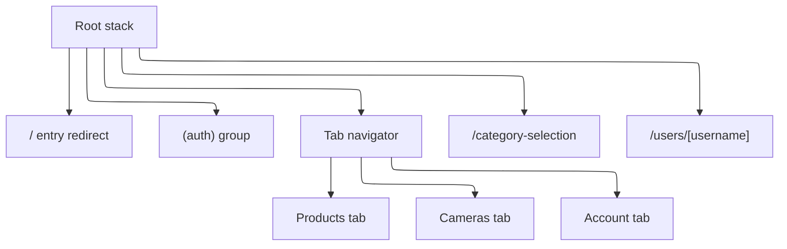
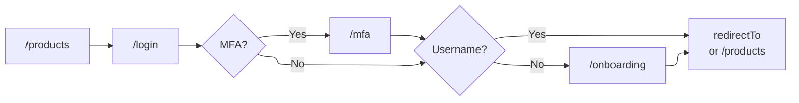
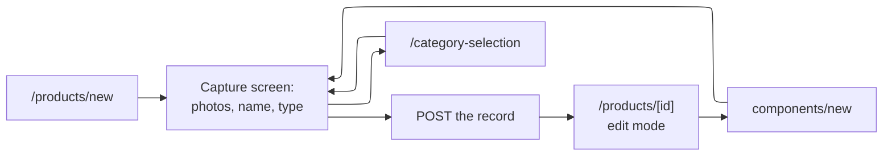

Read this before changing routing, auth gating, or the record-creation path. To learn how to use
the app, see [Getting started](/user-guides/getting-started/) and
[Data collection](/user-guides/data-collection/).

`app/README.md` documents the source layout behind these routes.

## Screen map

Routes live in `app/src/app/` as an Expo Router file tree. Segments in parentheses are groups:
they organize the tree without appearing in the URL, so `(tabs)/(products)/products/index.tsx`
is served at `/products`.

| Route | What it is |
| ----- | ---------- |
| `/` | Entry redirect. Renders nothing and sends you to `/products`. |
| `/login` | Password and OAuth sign-in. Accepts a `redirectTo` parameter. |
| `/new-account` | Password registration. |
| `/forgot-password`, `/reset-password` | Password reset request and completion. |
| `/mfa` | Second factor, reached only from a sign-in that needs one. |
| `/verify` | Email verification landing page, opened from a link. |
| `/onboarding` | Username choice, for accounts created without one. |
| `/products` | Product list. The app's home. |
| `/products/new` | Capture screen for a new top-level product. |
| `/products/[id]` | Product detail, also the edit surface. |
| `/products/[id]/components/new` | Capture screen for a component of that product. |
| `/components/[id]` | Component detail. Same screen family as a product. |
| `/components/[id]/components/new` | Capture screen for a nested component. |
| `/cameras` | Paired camera list. |
| `/cameras/add` | Pairing a new Raspberry Pi camera. |
| `/cameras/[id]` | Camera detail, live view and streaming controls. |
| `/account` | The signed-in account: profile, preferences, integrations, sign-out. |
| `/category-selection` | Category and product-type picker. Presents over whichever screen opened it. |
| `/users/[username]` | Public contributor profile. |

Three rules of that tree:

- **Each tab is a group holding its own Stack.** `(products)`, `(cameras)` and `(account)` are
  groups so that a tab keeps its navigation trail while you are on another one.
- **The products tab owns both `/products` and `/components`.** A component is a product's
  child, so cards, breadcrumbs and post-create redirects hop between the two trees within one
  navigator.
- **`/category-selection` and `/users/[username]` sit on the root stack, not in a tab.** More
  than one tab reaches them, so they join no single tab's trail.

Accounts with the Raspberry Pi integration switched off do not see the cameras destination. The
tab still exists; `useVisibleDestinations` in `src/navigation/destinations.ts` filters the
navigation chrome.

## Getting in

The app gates nothing behind a splash or a login wall. `/` redirects to `/products`, and the
product list renders for signed-out visitors. Each action asks for an account only when it
needs one.

**The auth gate** is `useRequireAuth(redirectTo)`. It replaces the current route with `/login`
and carries the caller's own path as `redirectTo`, so the person lands back where they were
going.

It holds that redirect back in three cases:

- while the session is still restoring, so a slow restore cannot flash a signed-in user to the
  login screen;
- on any screen that is not focused, because tab groups keep screens mounted off-focus and a
  stale redirect would fire after that screen had navigated elsewhere;
- during sign-out.

**`redirectTo` is validated.** `getSafeRedirectTarget` accepts only a path beginning with a
single `/`, and re-resolves it to confirm it cannot escape the app's origin. Anything else (an
absolute URL, a protocol-relative `//host`) is dropped and sign-in falls back to `/products`.
Every `redirectTo` from an external source must pass through that function.

**Two checks enforce onboarding.** `routeAuthenticatedUser` sends a fresh sign-in to
`/onboarding` when the account has no username. A root-level effect in `_layout.tsx` re-checks on
every path change, because an OAuth callback or a restored session reaches a signed-in state
without the sign-in screen. An account needs a username before it can own records. The same
effect bounces you off `/onboarding` once a username exists.

## Recording a product

Record creation is capture-first: photograph and name the product, save it, then fill in the
detail on the saved record. An interrupted lab session loses at most the photographs and the
name, never a part-filled form.

The move into the detail screen is a `replace`, not a `push`, so "back" from a saved record does
not return to the form that created it. Leaving the capture screen with unsaved input prompts
first; the flag that permits a discard also permits the post-save replace.

Adding a component runs the same path one level down, from `/products/[id]` or
`/components/[id]`. Nesting is not capped, but the breadcrumb trail is: `useAncestorTrail` walks
at most 12 ancestors, so a deeper record shows a truncated trail.

## Rules a routing change has to keep

**Crossing tabs uses `navigate`, never `replace`.** A replace that targets another navigator
swaps the whole tab navigator out and resets every tab's trail. Within one tab's stack, `replace`
is fine; the capture flow uses it.

**The category picker returns; it does not redirect.** The capture screen and a detail screen's
type field both push it and expect a selection back.

**Public profiles come back to `/products`.** A shared link can open `/users/[username]` with
nothing to pop back to, so its header back button navigates to `/products`.

**Detail screens are anchored-scroll documents.** Sections self-register and the chips (phone)
or outline (large web) scroll to them. Adding a section does not add a route.
