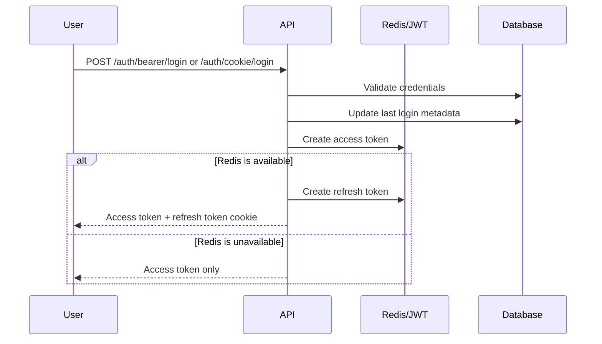
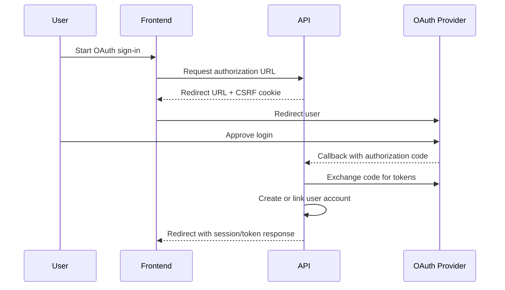
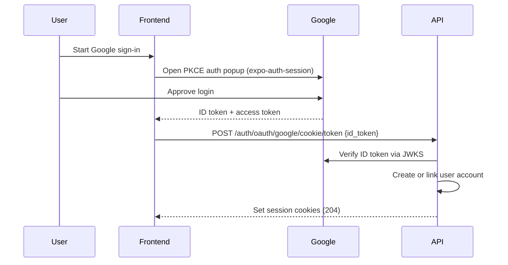

Bearer tokens for API clients, cookies for browser sessions. Both are supported, and Redis is part of the production auth path.

The auth system is built on [FastAPI-Users](https://fastapi-users.github.io/fastapi-users/latest/) with custom session and refresh-token handling. It exposes two main login transports:

- `bearer` for API clients that send an `Authorization: Bearer ...` token
- `cookie` for browser-based sessions that rely on the `auth` cookie

In development and tests, the access-token strategy can fall back to signed JWTs if Redis is unavailable. Outside development, Redis is expected to be present. Access tokens are short-lived and refresh tokens are handled separately.

## Supported Flows

- Email/password login
- Cookie-based login for web sessions
- Bearer-token login for programmatic clients
- Refresh-token rotation
- Logout and token revocation
- Password reset
- Email verification
- OAuth login and account linking for Google and GitHub
- Client-side PKCE OAuth for Google on web (no backend redirect required)
- Disposable email validation during registration

## Session Handling

Login also:

- updates `last_login_at` and `last_login_ip`
- creates a refresh token when Redis is available
- sets the `refresh_token` cookie for browser sessions

Refresh-token rotation happens through dedicated endpoints:

- `POST /auth/refresh` for bearer-style clients
- `POST /auth/cookie/refresh` for browser sessions

Logout clears the access cookie, deletes the refresh cookie, and blacklists the refresh token when present.

## OAuth

OAuth login is available for Google and GitHub. Each provider supports:

- a token-based callback flow
- a cookie-based callback flow
- account linking for existing users

Google accounts may be auto-linked by email because Google verifies ownership. GitHub linking is stricter and requires explicit association.

### Backend-mediated flow (GitHub all platforms, Google on native)

OAuth callbacks use a CSRF cookie and a signed state token. Redirect targets are restricted by allowlists in the auth settings.

### Client-side PKCE flow (Google on web)

The web frontend uses `expo-auth-session` to run a PKCE flow directly with Google, then exchanges the resulting ID token for a session via a dedicated backend endpoint. No backend redirect is involved, so there is no dependency on any third-party auth proxy.

The backend exposes two token-exchange endpoints:

- `POST /auth/oauth/google/cookie/token` — sets httpOnly session cookies (used by the web app)
- `POST /auth/oauth/google/bearer/token` — returns bearer + refresh tokens (for API clients)

## User-Facing Endpoints

??? note "Expand endpoint list"
\- `POST /auth/bearer/login`
\- `POST /auth/cookie/login`
\- `POST /auth/refresh`
\- `POST /auth/cookie/refresh`
\- `POST /auth/logout`
\- `POST /auth/register`
\- `POST /auth/verify`
\- `POST /auth/forgot-password`
\- `POST /auth/reset-password`
\- `GET /auth/validate-email`
\- `GET /auth/oauth/*`
\- `POST /auth/oauth/google/cookie/token`
\- `POST /auth/oauth/google/bearer/token`

For the full live surface, see the [interactive API docs](https://api.cml-relab.org/docs#tag/auth).
