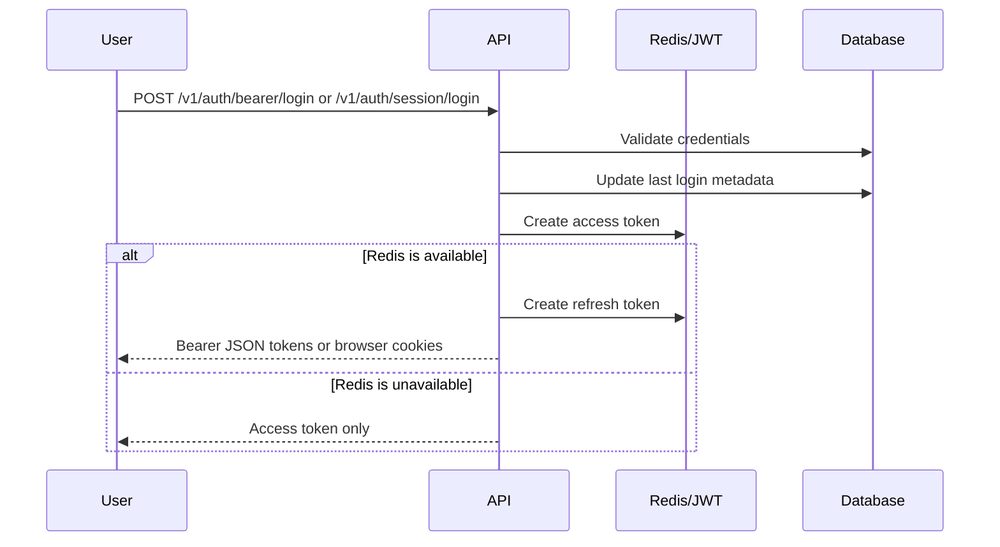
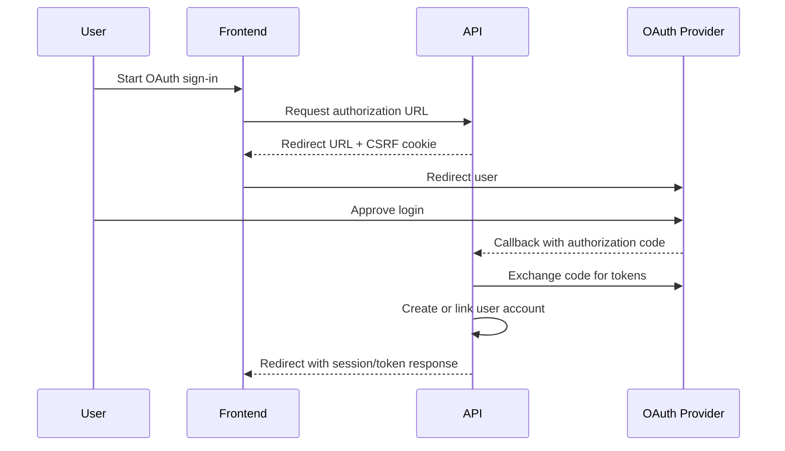

RELab supports bearer tokens for API clients and httpOnly cookies for browser sessions. Redis backs token storage and rate limiting outside local development.

Authentication is built on [FastAPI-Users](https://fastapi-users.github.io/fastapi-users/latest/) with RELab-specific refresh-token, session-cookie, OAuth, and validation logic.

The API exposes two login transports:

- bearer tokens for native apps, scripts, and API clients
- session cookies for browser-based clients

## Supported flows

- Email/password login with bearer-token or session-cookie responses
- Refresh-token rotation and logout revocation
- Password reset and email verification
- Google and GitHub OAuth login
- OAuth account linking for existing users
- Disposable email checks during registration

## Security controls

Password validation follows the project baseline from the [OWASP Authentication Cheat Sheet](https://cheatsheetseries.owasp.org/cheatsheets/Authentication_Cheat_Sheet.html). Passwords must be 12 to 128 characters, must not contain the username or email address, and are checked against a small local blocklist. New and reset passwords are also checked with Have I Been Pwned using the k-anonymity range API.

The breach check fails open if Have I Been Pwned is unavailable. The frontend keeps standard password inputs and does not block paste, so password managers work normally.

Changing `email` or `password` through `PATCH /v1/users/me` requires `current_password`. Username, profile, and preference updates do not. Email changes mark the account unverified, send a verification email to the new address, and send a security notification to the previous address.

Forgot-password responses do not reveal whether an account exists. The API returns the same accepted response for known, unknown, and inactive accounts and pads the response to a small minimum duration to reduce timing-based account enumeration. Login failures use the same bad-credentials response for unknown, invalid, and inactive accounts.

Rate limits use the existing Redis-backed `limits` integration:

- login by transient client-IP bucket and by a keyed digest of the submitted identifier
- forgot-password requests by transient client-IP bucket and by a keyed digest of the submitted email address
- reset-password submissions, registration, and email verification requests by transient client-IP bucket

Password reset uses side-channel email links. Reset tokens are valid for one hour and are invalidated after a successful password change because they include a fingerprint of the previous password hash. A successful reset revokes existing refresh tokens and sends a confirmation email without credentials, reset tokens, or reset links. The web app is served with `Referrer-Policy: no-referrer`; the app also removes the token from browser history after loading the reset page.

Auth logs record successful logins and rate-limit events. They do not include plaintext passwords, reset tokens, verification tokens, refresh tokens, full verification/reset URLs, or full email addresses.

## Token handling

Access tokens are short-lived. In development and tests, access-token storage can fall back to signed JWTs if Redis is unavailable. In production-like environments, Redis is expected to be present.

Successful login updates `last_login_at` without storing full login IP addresses on user accounts. Client IP addresses may still be processed transiently for Redis-backed rate limiting. When Redis is available, login also creates a refresh token. Browser sessions receive refresh and access cookies; bearer clients receive tokens in the response body.

Refresh-token rotation uses dedicated endpoints:

- `POST /v1/auth/bearer/refresh` for bearer clients
- `POST /v1/auth/session/refresh` for browser sessions

Bearer logout revokes the submitted refresh token. Session logout clears auth cookies, asks the browser to clear local session data, and blacklists the refresh token when one is present. `POST /v1/auth/sessions/revoke-all` revokes all refresh tokens for the current account and clears browser session state.

Refresh tokens are random bearer secrets. Redis stores them under SHA-256 fingerprints rather than raw token values, so Redis key names are not usable credentials if exposed. OAuth provider tokens that must remain reversible, such as Google/YouTube access and refresh tokens, are encrypted before database storage with AES-256-GCM using the backend `DATA_ENCRYPTION_KEY`.

Encryption is not used as a substitute for authorization. Authenticated API handlers must still check resource ownership and route-level permissions before returning or mutating data.

## OAuth

OAuth login is available for Google and GitHub. Both providers support session-cookie callbacks, bearer-token callbacks, and account linking. Google accounts may be linked by verified email. GitHub linking requires explicit association.

### Backend-mediated flow

Google and GitHub use the backend-mediated flow on all platforms.

Callbacks use a CSRF cookie and signed state token. Frontend redirect targets must exactly match the backend allowlist derived from `APP_PUBLIC_URL` (`/login` and `/profile`) plus the fixed native app redirects (`relab-app://login` and `relab-app://profile`). Entries are normalized as `scheme://host/path` and must not contain credentials, query strings, or fragments. Provider callback URLs are versioned under `/v1/oauth` and must be registered with each provider:

- `https://api.cml-relab.org/v1/oauth/google/session/callback`
- `https://api.cml-relab.org/v1/oauth/google/associate/callback`
- `https://api.cml-relab.org/v1/oauth/google-youtube/associate/callback`
- `https://api.cml-relab.org/v1/oauth/github/session/callback`
- `https://api.cml-relab.org/v1/oauth/github/associate/callback`

The public backend origin comes from `BACKEND_API_URL`; production currently uses `https://api.cml-relab.org`. Bearer callback routes use the same pattern, such as `/v1/oauth/google/token/callback`, when enabled for a client.

## Public auth endpoints

Expand endpoint list

- `POST /v1/auth/bearer/login`
- `POST /v1/auth/session/login`
- `POST /v1/auth/bearer/refresh`
- `POST /v1/auth/session/refresh`
- `POST /v1/auth/bearer/logout`
- `POST /v1/auth/session/logout`
- `POST /v1/auth/sessions/revoke-all`
- `POST /v1/auth/register`
- `POST /v1/auth/verify`
- `POST /v1/auth/forgot-password`
- `POST /v1/auth/reset-password`
- `GET /v1/auth/validate-email`
- `GET /v1/oauth/*`

For the full live surface, see the [API reference overview](/api-reference/) or jump directly to the [auth routes in the public API reference](/api/public/#tag/auth).
