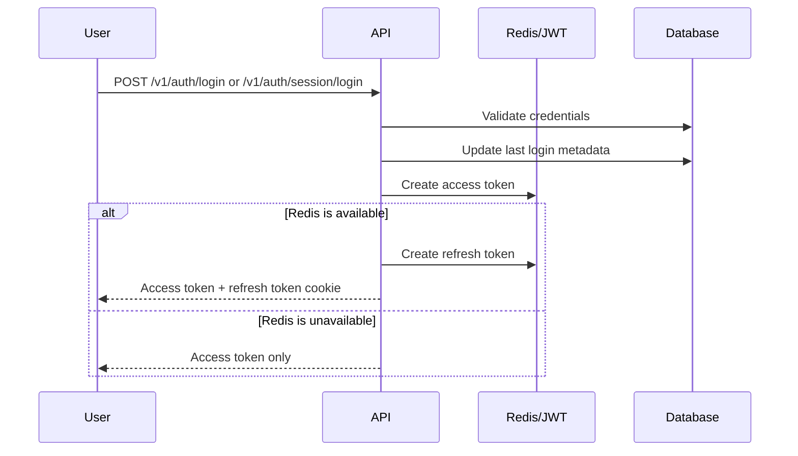
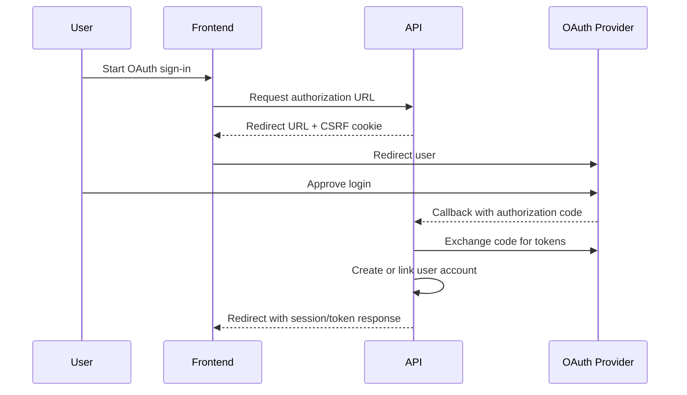

RELab supports bearer tokens for API clients and httpOnly cookies for browser sessions. Redis backs token storage and rate limiting outside local development.

Authentication is built on [FastAPI-Users](https://fastapi-users.github.io/fastapi-users/latest/) with RELab-specific refresh-token, session-cookie, OAuth, and validation logic.

The API exposes two login transports:

- bearer tokens for native apps, scripts, and API clients
- session cookies for browser-based clients

## Supported flows

- Email/password login with bearer-token or session-cookie responses
- Refresh-token rotation and logout revocation
- Password reset and email verification
- Google and GitHub OAuth login
- OAuth account linking for existing users
- Google PKCE login on web
- Disposable email checks during registration

## Security controls

Password validation follows the project baseline from the [OWASP Authentication Cheat Sheet](https://cheatsheetseries.owasp.org/cheatsheets/Authentication_Cheat_Sheet.html). Passwords must be 12 to 128 characters, must not contain the username or email address, and are checked against a small local blocklist. New and reset passwords are also checked with Have I Been Pwned using the k-anonymity range API.

The breach check fails open if Have I Been Pwned is unavailable. The frontend keeps standard password inputs and does not block paste, so password managers work normally.

Changing `email` or `password` through `PATCH /v1/users/me` requires `current_password`. Username, profile, and preference updates do not.

Forgot-password responses do not reveal whether an account exists. Login failures use the same bad-credentials response for unknown, invalid, and inactive accounts.

Rate limits use the existing Redis-backed `limits` integration:

- login by client IP and by a hash of the submitted identifier
- registration, email verification requests, and forgot-password requests by client IP

Auth logs record successful logins and rate-limit events. They do not include plaintext passwords, reset tokens, verification tokens, or refresh tokens.

## Token handling

Access tokens are short-lived. In development and tests, access-token storage can fall back to signed JWTs if Redis is unavailable. In production-like environments, Redis is expected to be present.

Successful login updates `last_login_at` and `last_login_ip`. When Redis is available, login also creates a refresh token. Browser sessions receive refresh and access cookies; bearer clients receive tokens in the response body.

Refresh-token rotation uses dedicated endpoints:

- `POST /v1/auth/refresh` for bearer clients
- `POST /v1/auth/session/refresh` for browser sessions

Logout clears auth cookies and blacklists the refresh token when one is present.

Refresh tokens are random bearer secrets. Redis stores them under SHA-256 fingerprints rather than raw token values, so Redis key names are not usable credentials if exposed. OAuth provider tokens that must remain reversible, such as Google/YouTube access and refresh tokens, are encrypted before database storage with the backend `DATA_ENCRYPTION_KEYS` keyring.

Encryption is not used as a substitute for authorization. Authenticated API handlers must still check ownership, organization membership, and route-level permissions before returning or mutating data.

## OAuth

OAuth login is available for Google and GitHub. Both providers support session-cookie callbacks, bearer-token callbacks, and account linking. Google accounts may be linked by verified email. GitHub linking requires explicit association.

### Backend-mediated flow

GitHub uses the backend-mediated flow on all platforms. Google uses it on native clients.

Callbacks use a CSRF cookie and signed state token. Redirect targets are restricted by auth-setting allowlists. Provider callback URLs are versioned under `/v1/oauth` and must be registered with each provider:

- `https://api.cml-relab.org/v1/oauth/google/session/callback`
- `https://api.cml-relab.org/v1/oauth/google/associate/callback`
- `https://api.cml-relab.org/v1/oauth/google-youtube/associate/callback`
- `https://api.cml-relab.org/v1/oauth/github/session/callback`
- `https://api.cml-relab.org/v1/oauth/github/associate/callback`

The public backend origin comes from `BACKEND_API_URL`; production currently uses `https://api.cml-relab.org`. Bearer callback routes use the same pattern, such as `/v1/oauth/google/token/callback`, when enabled for a client.

### Google PKCE flow

The web frontend uses `expo-auth-session` to run Google PKCE directly in the browser, then exchanges the Google ID token with RELab. No backend redirect or third-party auth proxy is involved.

Google token exchange endpoints:

- `POST /v1/oauth/google/session/token` — sets httpOnly session cookies (used by the web app)
- `POST /v1/oauth/google/bearer/token` — returns bearer + refresh tokens (for API clients)

## Public auth endpoints

Expand endpoint list

- `POST /v1/auth/login`
- `POST /v1/auth/session/login`
- `POST /v1/auth/refresh`
- `POST /v1/auth/session/refresh`
- `POST /v1/auth/logout`
- `POST /v1/auth/register`
- `POST /v1/auth/verify`
- `POST /v1/auth/forgot-password`
- `POST /v1/auth/reset-password`
- `GET /v1/auth/validate-email`
- `GET /v1/oauth/*`
- `POST /v1/oauth/google/session/token`
- `POST /v1/oauth/google/bearer/token`

For the full live surface, see the [interactive API docs](https://api.cml-relab.org/docs#tag/auth).
