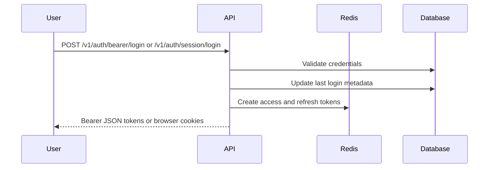
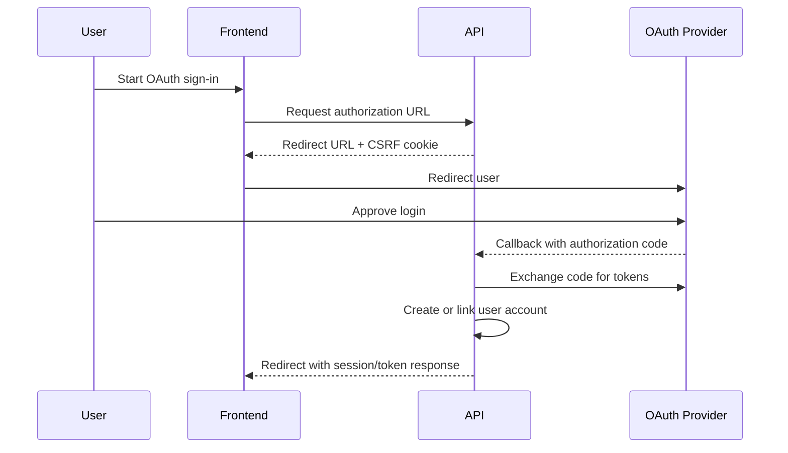

The API exposes two login transports: bearer tokens for native apps, scripts, and API clients, and httpOnly session cookies for browsers. Redis backs auth token storage, MFA challenge state, and rate limiting.

Authentication builds on [FastAPI-Users](https://fastapi-users.github.io/fastapi-users/latest/) with Relab-specific refresh-token, session-cookie, OAuth, and validation logic.

## Supported flows

- Email/password login with optional TOTP MFA completion for accounts that enable it
- Refresh-token rotation and logout revocation
- Password reset and email verification
- Google and GitHub OAuth login with the same optional TOTP MFA completion step
- OAuth account linking for existing users
- Disposable email checks during registration

## Security controls

Password validation follows the [OWASP Authentication Cheat Sheet](https://cheatsheetseries.owasp.org/cheatsheets/Authentication_Cheat_Sheet.html). Passwords must be 12 to 128 characters and must not contain the username or email address. They are checked against a committed common-password list (seeded into Redis when available) and against Have I Been Pwned through the k-anonymity range API. The breach check fails open if Have I Been Pwned is unavailable. Stored passwords use Argon2id; Relab stores no reversible passwords.

Password inputs do not block paste, so password managers work.

Changing `email` or `password` through `PATCH /v1/users/me` requires `current_password`. Username, profile, and preference updates do not. Email changes mark the account unverified, send a verification email to the new address, and send a security notification to the previous address. Password changes send a security notification to the account email address.

TOTP MFA is optional account hardening:

- Accounts without TOTP receive bearer tokens or session cookies after a successful password or OAuth login.
- Accounts with TOTP receive a short-lived challenge token and must submit a current one-time code before the API issues credentials.
- Sensitive backend routes can require confirmed MFA through the MFA dependency.
- TOTP seeds and pending challenge tokens use cryptographically secure randomness.
- Accepted TOTP counters are recorded briefly to prevent replay within the clock window.
- Administrators can reset a user's MFA enrollment after identity-proofed recovery, but cannot choose a replacement factor.

Forgot-password returns the same accepted response for known, unknown, and inactive accounts, padded to a small minimum duration against timing-based enumeration. Login failures use the same bad-credentials response for unknown, invalid, and inactive accounts.

Rate limits use the Redis-backed `limits` integration:

- login by transient client-IP bucket and by a keyed digest of the submitted identifier
- forgot-password requests by transient client-IP bucket and by a keyed digest of the submitted email address
- reset-password submissions, registration, and email verification requests by transient client-IP bucket

Password reset uses email links. Reset tokens are valid for one hour and include a fingerprint of the previous password hash, so a successful change invalidates them. A successful reset revokes existing refresh tokens and sends a confirmation email without credentials, tokens, or links. The web app is served with `Referrer-Policy: no-referrer` and removes the token from browser history after loading the reset page.

Auth logs record successful logins and rate-limit events. They do not include plaintext passwords, reset tokens, verification tokens, refresh tokens, full verification/reset URLs, or full email addresses.

## Token handling

```mermaid
sequenceDiagram
    accTitle: Login and token issuance flow
    accDescr: A user submits bearer or session login credentials to the API, which validates them against the database, updates last-login metadata, creates access and refresh tokens in Redis, and returns bearer JSON tokens or browser cookies.
    participant User
    participant API
    participant TokenStore as Redis
    participant DB as Database

    User->>API: POST /v1/auth/bearer/login or /v1/auth/session/login
    API->>DB: Validate credentials
    API->>DB: Update last login metadata
    API->>TokenStore: Create access and refresh tokens
    API-->>User: Bearer JSON tokens or browser cookies
```

Access tokens live 15 minutes. Auth flows require Redis and fail closed without it.

Login updates `last_login_at`; client IP addresses are processed only transiently for rate limiting and never stored on the account. Browser sessions receive refresh and access cookies; bearer clients receive tokens in the response body.

Refresh-token rotation uses dedicated endpoints:

- `POST /v1/auth/bearer/refresh` for bearer clients
- `POST /v1/auth/session/refresh` for browser sessions

Refresh tokens have a 30-day inactivity lifetime and a 30-day absolute session lifetime. Each refresh rotates the token but keeps the original absolute expiry, so activity cannot extend a session beyond 30 days. An account may hold several concurrent sessions. "Sign out everywhere" on the profile screen ends all of them; there is no per-device session inventory.

Token revocation events:

- **Bearer logout:** revokes the submitted refresh token.
- **Session logout:** clears auth cookies, asks the browser to clear local session data, and blacklists the refresh token when one is present.
- **Revoke all** (`POST /v1/auth/sessions/revoke-all`): revokes every refresh *and* access token for the account and clears browser session state.
- **Password reset, password change, email change, account deactivation, and account deletion:** all revoke every refresh and access token for the affected account.

Access tokens carry their issue time, and each revocation records a per-user epoch in Redis; a token issued before that epoch is refused on its next request. Revocation is immediate, not bounded by the 15-minute lifetime. Refresh state is purged before the epoch is stamped, so a refresh racing the revocation cannot mint a token that outlives it.

Refresh tokens are random bearer secrets stored in Redis under SHA-256 fingerprints, so the keys are not usable credentials if exposed. OAuth provider tokens that must stay reversible (Google/YouTube access and refresh tokens) are encrypted with AES-256-GCM under `DATA_ENCRYPTION_KEY` before database storage.

Authorization is enforced in the backend route layer, not by client UI state. FastAPI dependencies separate public reads, authenticated self-service, verified-user writes, owner-scoped resources, device assertions, and superuser-only admin routes. Request bodies cannot set account-control or ownership fields, and product owner identity is redacted from viewers who cannot see the owner's profile.

## OAuth

Google and GitHub support session-cookie callbacks, bearer-token callbacks, and account linking. Google accounts may be linked by verified email; GitHub linking requires explicit association. OAuth login creates Relab-owned sessions; Relab does not perform IdP-wide logout.

### Backend-mediated flow

Google and GitHub use the backend-mediated flow on all platforms.

Callbacks use a CSRF cookie and signed state token. Frontend redirect targets must exactly match the backend allowlist derived from `APP_PUBLIC_URL` (`/login` and `/account`) plus the fixed native app redirects (`relab-app://login` and `relab-app://account`). Entries are normalized as `scheme://host/path` and must not contain credentials, query strings, or fragments. Provider callback URLs are versioned under `/v1/oauth` and must be registered with each provider:

- `https://api.cml-relab.org/v1/oauth/google/session/callback`
- `https://api.cml-relab.org/v1/oauth/google/associate/callback`
- `https://api.cml-relab.org/v1/oauth/google-youtube/associate/callback`
- `https://api.cml-relab.org/v1/oauth/github/session/callback`
- `https://api.cml-relab.org/v1/oauth/github/associate/callback`

The public backend origin comes from `API_PUBLIC_URL`; production uses `https://api.cml-relab.org`. Bearer callback routes use the same pattern, such as `/v1/oauth/google/token/callback`, when enabled for a client.

Callback results travel only in the URL fragment: `#status=success`, `#status=error&error=<code>`, or `#status=mfa_required&mfa_handoff=<one-time-handoff>`. The app reads the fragment and clears it from browser history; access tokens never travel through callback URLs. When OAuth login needs MFA, the app claims the one-time handoff through the API, keeps the pending challenge in runtime or session storage, and routes to the MFA screen. The MFA challenge token itself never appears in a query string or fragment.

```mermaid
sequenceDiagram
    accTitle: OAuth sign-in flow
    accDescr: The frontend requests an authorization URL from the API, redirects the user to the OAuth provider, and after the user approves, the provider calls back to the API, which exchanges the code for tokens, creates or links the user account, and redirects the frontend with a session or token response.
    participant User
    participant Frontend
    participant API
    participant Provider as OAuth Provider

    User->>Frontend: Start OAuth sign-in
    Frontend->>API: Request authorization URL
    API-->>Frontend: Redirect URL + CSRF cookie
    Frontend->>Provider: Redirect user
    User->>Provider: Approve login
    Provider-->>API: Callback with authorization code
    API->>Provider: Exchange code for tokens
    API->>API: Create or link user account
    API-->>Frontend: Redirect with session/token response
```

## Public auth endpoints

Expand endpoint list

- `POST /v1/auth/bearer/login`
- `POST /v1/auth/session/login`
- `POST /v1/auth/mfa/totp/setup`
- `POST /v1/auth/mfa/totp/confirm`
- `POST /v1/auth/mfa/oauth/claim`
- `POST /v1/auth/mfa/challenge`
- `POST /v1/auth/bearer/refresh`
- `POST /v1/auth/session/refresh`
- `POST /v1/auth/bearer/logout`
- `POST /v1/auth/session/logout`
- `POST /v1/auth/sessions/revoke-all`
- `POST /v1/auth/register`
- `POST /v1/auth/verify`
- `POST /v1/auth/forgot-password`
- `POST /v1/auth/reset-password`
- `POST /v1/auth/validate-email`
- `GET /v1/oauth/*`

For the full live surface, see the [API reference overview](/api-reference/) or open the [public API reference](/api/public/).
