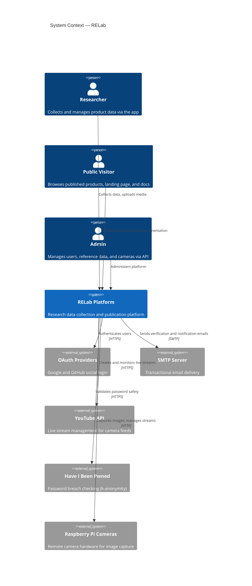
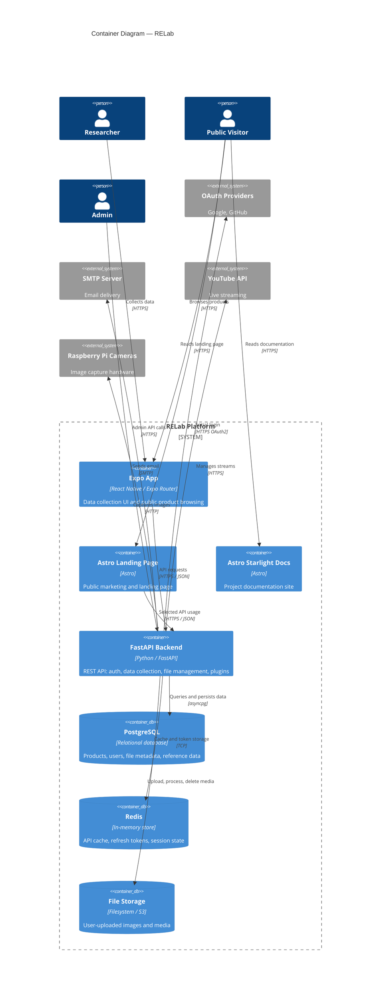
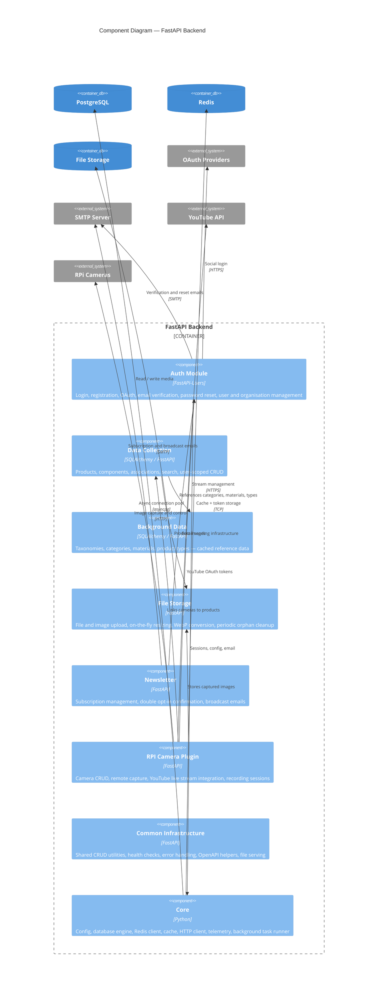

Formal architecture views following the <a href="https://c4model.com">C4 model</a> (Context, Container, Component, Code). These diagrams provide progressively detailed views of the platform for technical documentation and academic reference. We omit Code-level diagrams as they are not manually maintainable and do not add value beyond IDE-generated views of the codebase.

## Level 1 — System Context

Who uses RELab, and what external services does it depend on?

## Level 2 — Container Diagram

What are the major deployable units inside the platform, and how do they interact?

## Level 3 — Component Diagram (Backend)

What are the domain modules inside the FastAPI backend, and how do they relate to each other and to external services?

