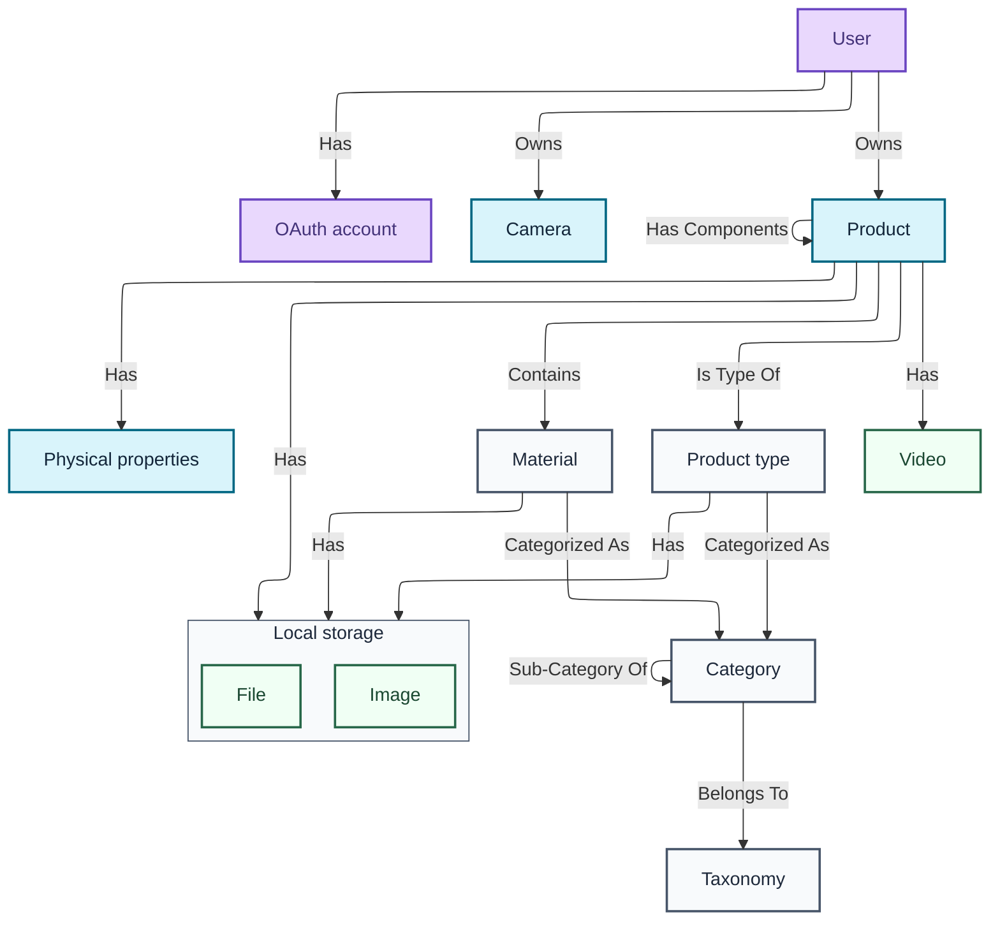
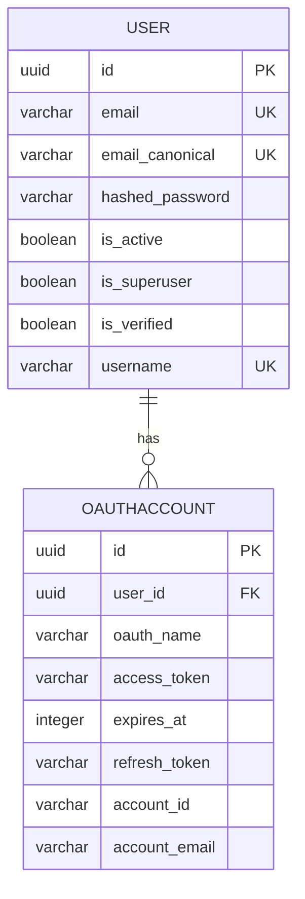
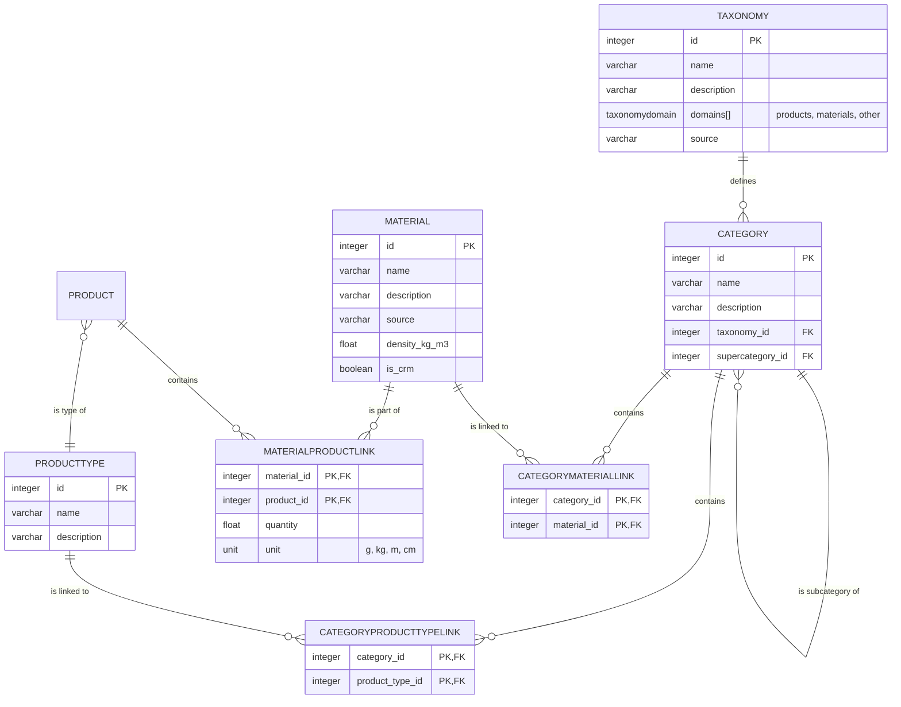
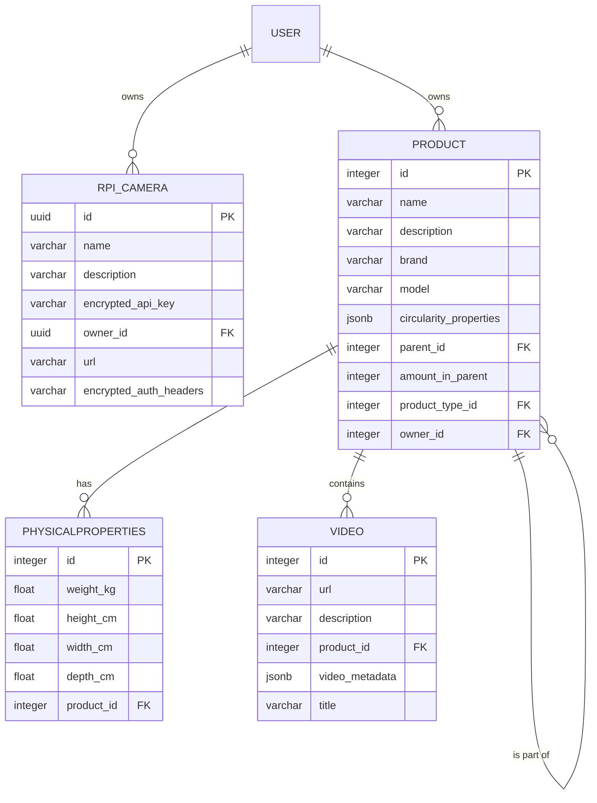
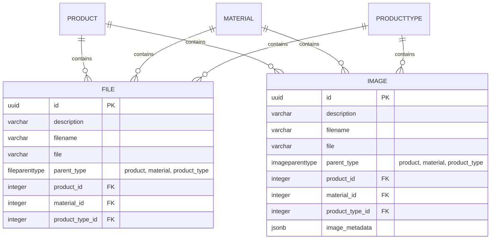

The full data schema is broken up into four modules: user management, reference data management, data collection, and file storage.

## User management

This part covers user accounts, linked OAuth accounts, and ownership and access control. It is kept separate from the research entities so auth concerns do not leak into the product model more than necessary.

## Reference data

This part contains the shared reference layer used to keep records more consistent: taxonomies, categories and subcategories, materials, product types, and units.

These records are shared across users and products. They are not the research record itself, but they make the research record easier to search, compare, and reuse.

## Data collection

The data collection model is centred on `Product`, which is used both for top-level products and nested components. That makes it possible to represent a disassembly tree without separate tables for products and parts.

Important characteristics:

- a product can have a parent product, enabling component hierarchies
- physical measurements are first-class product fields
- circularity notes are stored on the product as nullable JSON with optional `recyclability`, `disassemblability`, and `remanufacturability` fields
- ownership is attached to the user level
- materials, product types, and media can be linked without making every field mandatory

## File storage and media

Media is treated as part of the record, not as decoration. In practice, images often carry a large part of the evidential value of a product record. Files and images support polymorphic associations, allowing them to be linked to products, materials, or product types. Videos are currently linked via URLs rather than stored directly.

