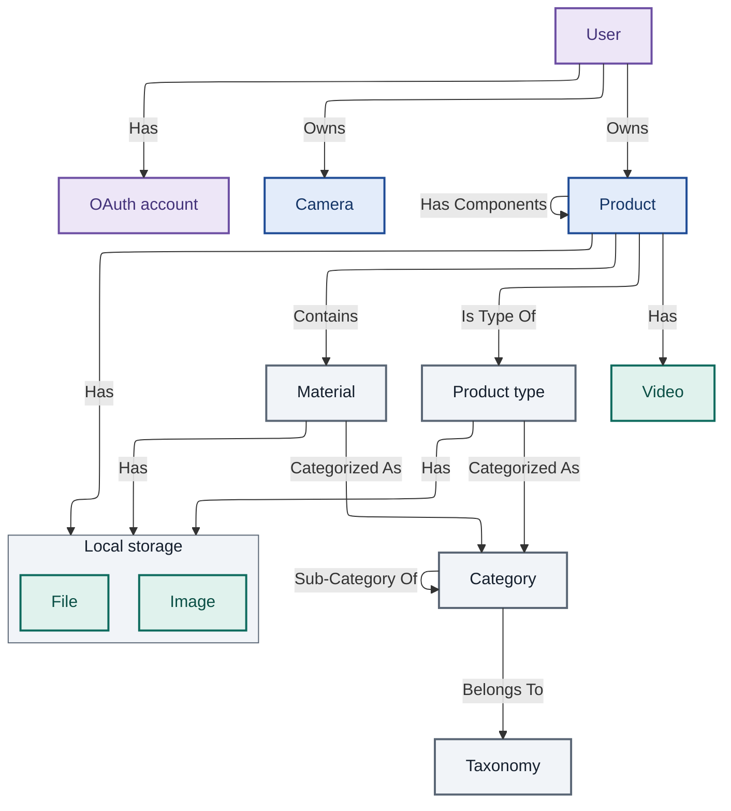

import UserManagement from '@/components/datamodel/user-management.generated.mdx';
import ReferenceData from '@/components/datamodel/reference-data.generated.mdx';
import DataCollection from '@/components/datamodel/data-collection.generated.mdx';
import FileStorage from '@/components/datamodel/file-storage.generated.mdx';
import CameraPlugin from '@/components/datamodel/camera-plugin.generated.mdx';

```mermaid
---
config:
    layout: elk
---
graph TD
    accTitle: Relab data model overview
    accDescr: Users own cameras and products and link OAuth accounts; products form a self-referential component hierarchy, carry physical properties and circularity notes directly, and are linked to product types and materials; product types and materials are categorized under taxonomies; products, materials, and product types can each have files and images attached, and products can also have videos.

        User["User"]
        OAuthAccount["OAuth account"]

        Camera["Camera"]
        Product["Product"]

        Taxonomy["Taxonomy"]
        Material["Material"]
        Category["Category"]
        ProductType["Product type"]

        subgraph LocalStorage["Local storage"]
            File["File"]
            Image["Image"]
        end
        Video["Video"]

    User -->|Has| OAuthAccount
    User -->|Owns| Camera

    User -->|Owns| Product
    Product -->|Has Components| Product
    Product -->|Contains| Material
    Product -->|Is Type Of| ProductType
    ProductType -->|Categorized As| Category
    Material -->|Categorized As| Category
    Category -->|Sub-Category Of| Category
    Category -->|Belongs To| Taxonomy
    Product -->|Has| LocalStorage
    Product -->|Has| Video
    Material -->|Has| LocalStorage
    ProductType -->|Has| LocalStorage

    %% Diagram palette from assets/DESIGN.md (categorical ramp)
    style LocalStorage fill:#f1f4f8,stroke:#5a6675,stroke-width:1px,color:#16202e;

    classDef UserManagementFill fill:#ede6f7,stroke:#6d4fa3,stroke-width:2px,color:#44337a;
    class User,OAuthAccount UserManagementFill;

    classDef DataCollectionFill fill:#e3ecfa,stroke:#1f4c96,stroke-width:2px,color:#143567;
    class Product,Camera DataCollectionFill;

    classDef ReferenceDataFill fill:#f1f4f8,stroke:#5a6675,stroke-width:2px,color:#16202e;
    class Taxonomy,Material,Category,ProductType ReferenceDataFill;

    classDef MediaFill fill:#e0f2ed,stroke:#0e6b5e,stroke-width:2px,color:#0a4f45;
    class File,Image,Video MediaFill;
```

The full data schema is broken up by bounded context: user management, reference data, data collection, file storage, and the camera plugin.

Someone drew the diagram above by hand, and it simplifies on purpose. `backend/scripts/generate/export_datamodel.py` generates the per-context diagrams below from the ORM metadata, so they list every column and every foreign key the database really has. `just check` fails when they fall behind the models.

## User management

This part covers user accounts, linked OAuth accounts, and ownership and access control. It is kept separate from the research entities so account details stay out of the product model.

<UserManagement />

Usernames are unique and indexed for fast public profile lookup. They are nullable only while an OAuth-created account is completing onboarding; password registration requires a username up front.

`hashed_password` and `mfa_totp_secret` appear in no read schema, so no response ever carries them, and the TOTP secret is encrypted at rest on top of that. `profile_stats` is a cached aggregate that `profile_stats_computed_at` stamps, rather than a figure recomputed per request. `upload_file_count` and `upload_total_bytes` hold the per-account upload quota ledger.

## Reference data

This part contains the shared reference layer used to keep records more consistent: taxonomies, categories and subcategories, materials, product types, and units.

These records are shared across users and products. They are not the research record itself, but they make the research record easier to search, compare, and reuse.

<ReferenceData />

`materialproductlink` records how much of a material sits in a product. It belongs to data collection rather than here, because it carries a measurement rather than a classification, so it appears in the next diagram.

## Data collection

The data collection model is centered on `Product`, which is used both for top-level products and nested components. That makes it possible to represent a disassembly tree without separate tables for products and parts.

Important characteristics:

- a product can have a parent product, enabling component hierarchies
- physical measurements are first-class product fields
- circularity notes are stored on the product as nullable JSON with optional `recyclability`, `disassemblability`, and `remanufacturability` fields
- ownership is attached to the user level
- materials, product types, and media can be linked without making every field mandatory

<DataCollection />

## File storage and media

Images often carry a large part of the evidential value of a product record, so media is modeled as part of the record itself. Files and images support polymorphic associations, allowing them to be linked to products, materials, or product types. Videos are linked via URLs rather than stored directly.

<FileStorage />

`video` sits in this context even though a video attaches to a product. The platform stores a URL and its metadata, which makes the row a media reference like the other two.

## Camera plugin

The Raspberry Pi camera integration owns two tables. `camera` holds a paired device and the relay credential that authenticates it; `recording_session` links a live broadcast to the video row it produces. [RPi camera plugin](/architecture/rpi-cam/) covers the pairing and streaming path these tables support.

<CameraPlugin />
