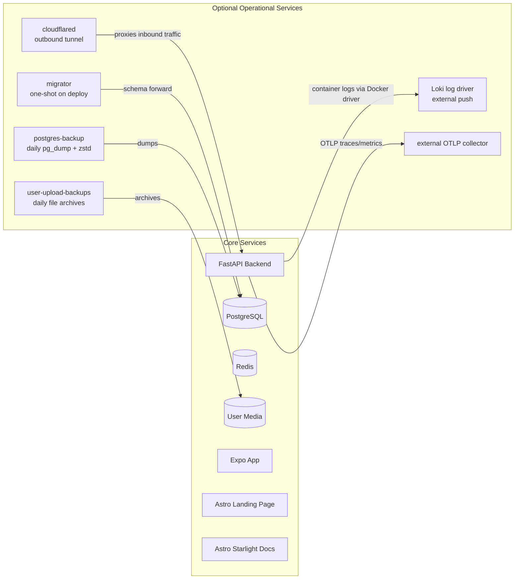

RELab runs as a self-hosted Docker Compose stack sized for a single VPS.

## Compose Service Topology

The deployed stack is defined entirely in Docker Compose. Core services run in all environments. Some deployments also enable additional operational services such as migrations, backups, the Cloudflare tunnel, and optional log/trace shipping to an external monitoring stack.

Backup services are enabled through Compose profiles. Telemetry is opt-in through host-level environment variables: `LOKI_URL` enables the optional Loki logging overlay, and `OTEL_EXPORTER_OTLP_ENDPOINT` enables backend OTLP export.

For formal architecture views of the platform as a whole, see [C4 Architecture Diagrams](../c4-diagrams/).

## Storage and Backups

- PostgreSQL stores the primary application state.
- Uploaded files and images are stored on disk and served by the backend.
- Database dumps and user-uploaded files are backed up regularly to cloud storage.
- Alembic migrations move schema state forward in a controlled way.

## Quality Controls

- backend: unit and integration tests, linting, and type checking
- frontend-app: Jest tests for app logic and UI components
- frontend-web: Vitest and Playwright coverage for the public site
- docs: formatting, spelling checks, and build smoke tests

The repository also includes dependency maintenance, container scanning, performance baselines, and repository-level checks through GitHub Actions.

## Operational Considerations

- Redis is used both for caching and parts of the authentication and token flow. Partial Redis outages have user-facing effects.
- Uploaded media is part of the research record and should be treated as primary data, not as disposable assets.
- Production secrets and origin/host configuration matter; the backend enforces stricter checks outside development.
- Telemetry is optional. When enabled, the backend exports OTLP traces and metrics to an external collector, while Docker ships container logs to Loki through the optional overlay.
- The Compose-based setup is easy to reason about, but scaling and secret rotation are less automated than in a larger platform setup. That trade-off is deliberate.
