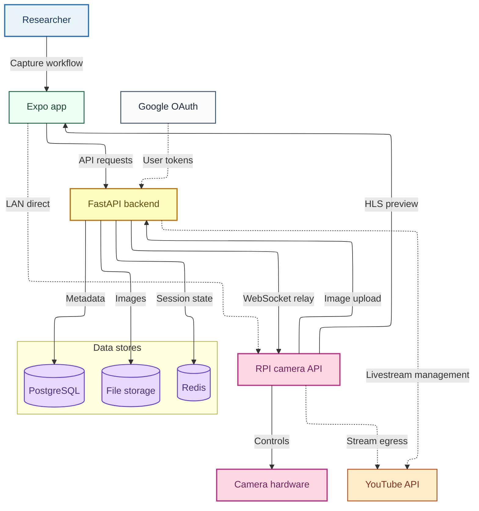
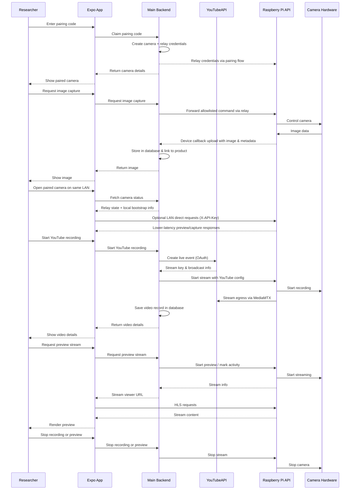

An optional plugin that connects camera devices to RELab for remote capture, HLS preview streaming, and YouTube streaming. The backend remains the control plane and default relay path; when the camera and client share a LAN, the RELab app can optionally switch to direct local access for lower-latency preview and capture.

For platform-side setup and day-to-day usage, see the [RPI camera user guide](../../user-guides/rpi-cam/). For device installation and deployment, see the [RPI camera plugin repository](https://github.com/CMLPlatform/relab-rpi-cam-plugin).

## System diagram



## Interaction flow



## Key design decisions

- **Backend as control plane**: Pairing, relay orchestration, capture storage, and YouTube coordination stay in the main backend.
- **Two contract layers**: backend OpenAPI remains the public app-facing contract, while a smaller shared private device contract covers pairing payloads, relay envelopes, local-access bootstrap, and Pi-initiated upload acknowledgements.
- **Optional local direct mode**: After pairing, the app can switch to LAN-direct access with a device-local API key for lower-latency preview and capture when the device is reachable locally.
- **Relay-first registration**: Cameras pair through a short-lived code and receive runtime relay credentials from the backend; operators do not manually copy long-lived API keys in the normal path.
- **Media storage**: Captured images are stored in RELab's file storage and linked to the originating product or component record automatically.
- **Optional YouTube integration**: Streaming is mediated through the backend's OAuth connection to YouTube. The device streams directly to YouTube once authorised.

## Contract ownership

- **Frontend -> backend** uses only backend-owned public routes and schemas.
- **Backend -> plugin** uses a smaller private device seam: pairing register/poll payloads, relay command/response envelopes, local-access info, and direct upload/self-unpair acknowledgements.
- **Shared models** exist to keep that private seam typed and versioned without leaking plugin implementation details into the frontend contract.

## Protocol boundaries

The plugin uses three separate contracts:

- **App REST API**: `/v1/plugins/rpi-cam/cameras/*` for app-facing camera CRUD, status, capture commands, telemetry, local-access bootstrap, and stream controls.
- **Device REST API**: `/v1/plugins/rpi-cam/device/cameras/*` for Pi-originated callbacks such as image upload, preview thumbnail upload, and self-unpair. These routes authenticate with short-lived device assertions rather than a user session.
- **Device WebSocket protocol**: `/v1/plugins/rpi-cam/ws/connect` for the persistent outbound relay tunnel from the Pi to the backend. It is a non-browser endpoint: the Pi authenticates with a short-lived bearer device assertion, production pairing returns a `wss://` URL, browser `Origin` handshakes are rejected, WebSocket compression is disabled, and frame/queue sizes are bounded.

OpenAPI covers the HTTP routes. The WebSocket tunnel is a protocol contract and should be treated separately from generated REST clients.

### WebSocket relay envelope

The backend sends command envelopes to the device:

```json
{
  "id": "request-id",
  "method": "POST",
  "path": "/captures",
  "params": {},
  "body": {
    "product_id": 123,
    "description": "Front panel"
  },
  "headers": {}
}
```

The device replies with a matching response envelope. The shared model package owns the exact envelope schema so the backend and plugin stay in lockstep.

The relay allowlist is intentionally small:

- `GET /camera`
- `POST /captures`
- `GET|POST|DELETE /streams/youtube`
- `GET /system/telemetry`
- `GET /system/local-access`
- `DELETE /pairing`
- `GET /preview/hls/*`

Captured image bytes do not travel through the WebSocket. After a capture command succeeds, the Pi uploads the file and metadata directly to `/v1/plugins/rpi-cam/device/cameras/{camera_id}/image-upload`.

### Device callback routes

Pi-originated HTTP callbacks are plugin-scoped instead of using a generic `/device` namespace because RELab currently has one device family:

- `POST /v1/plugins/rpi-cam/device/cameras/{camera_id}/image-upload`
- `POST /v1/plugins/rpi-cam/device/cameras/{camera_id}/preview-thumbnail-upload`
- `DELETE /v1/plugins/rpi-cam/device/cameras/{camera_id}/self`

If RELab adds multiple device families later, the protocol docs can be split by plugin while keeping this same audience model.
