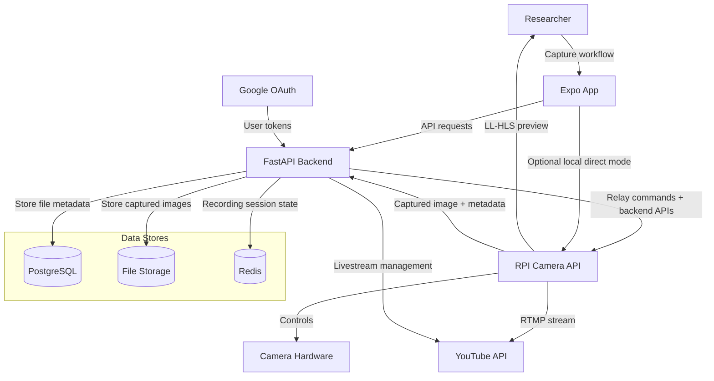
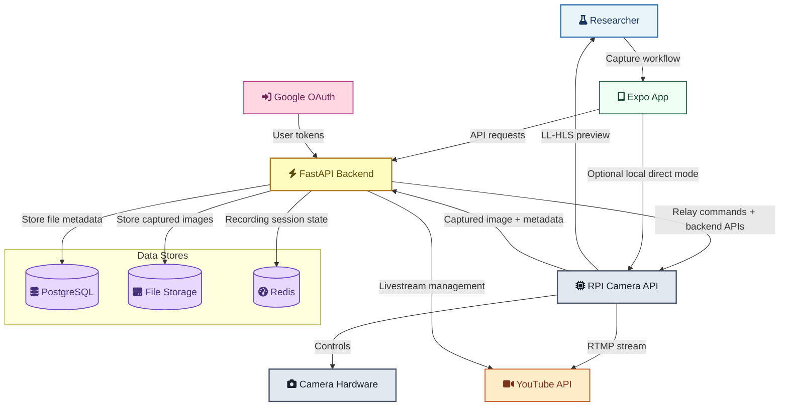
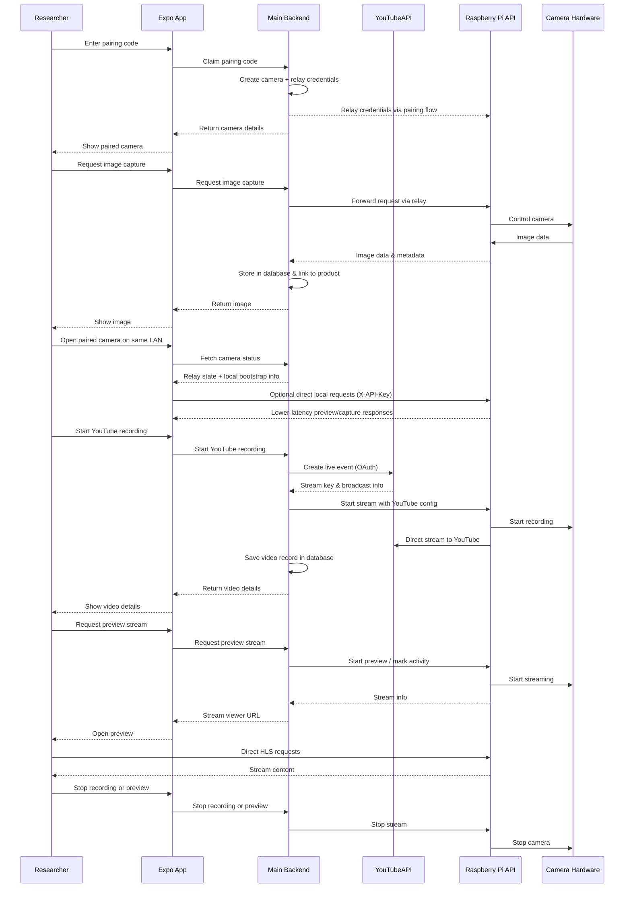

<!-- spell-checker: ignore RTMP -->

<div class="relab-section-intro">
An optional plugin that connects camera devices to RELab for remote capture, LL-HLS preview streaming, and YouTube streaming. The backend remains the control plane and default relay path; when the camera and client share a LAN, the RELab app can optionally switch to direct local access for lower-latency preview and capture.
</div>

For platform-side setup and day-to-day usage, see the [RPI Camera User Guide](../../user-guides/rpi-cam/). For device installation and deployment, see the [RPI Camera Plugin repository](https://github.com/CMLPlatform/relab-rpi-cam-plugin).

## System Diagram



??? info "Styled diagram (ELK layout)"

````

````

## Interaction Flow



## Key Design Decisions

- **Backend as control plane**: Pairing, relay orchestration, capture storage, and YouTube coordination stay in the main backend.
- **Two contract layers**: backend OpenAPI remains the public app-facing contract, while a smaller shared private device contract covers pairing payloads, relay envelopes, local-access bootstrap, and Pi-initiated upload acknowledgements.
- **Optional local direct mode**: After pairing, the app can switch to LAN-direct access for lower-latency preview and capture when the device is reachable locally.
- **Relay-first registration**: Cameras pair through a short-lived code and receive runtime relay credentials from the backend; operators do not manually copy long-lived API keys in the normal path.
- **Media storage**: Captured images are stored in RELab's file storage and linked to the originating product or component record automatically.
- **Optional YouTube integration**: Streaming is mediated through the backend's OAuth connection to YouTube. The device streams directly to YouTube once authorised.

## Contract Ownership

- **Frontend -> backend** uses only backend-owned public routes and schemas.
- **Backend -> plugin** uses a smaller private device seam: pairing register/poll payloads, relay command/response envelopes, local-access info, and direct upload/self-unpair acknowledgements.
- **Shared models** exist to keep that private seam typed and versioned without leaking plugin implementation details into the frontend contract.
