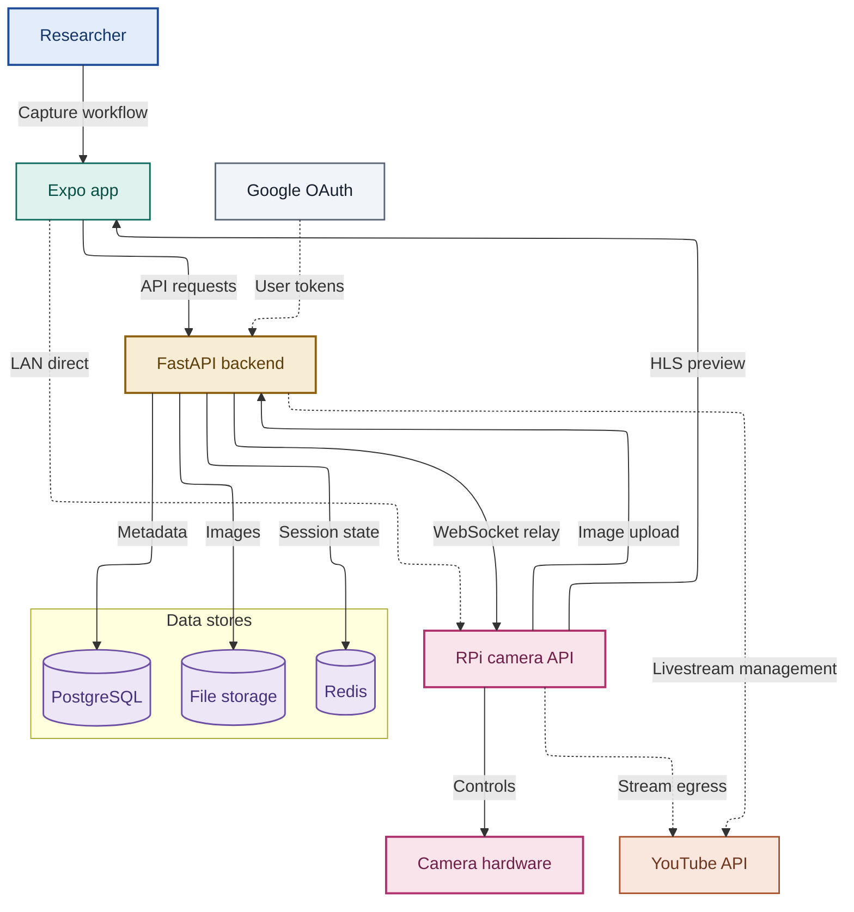
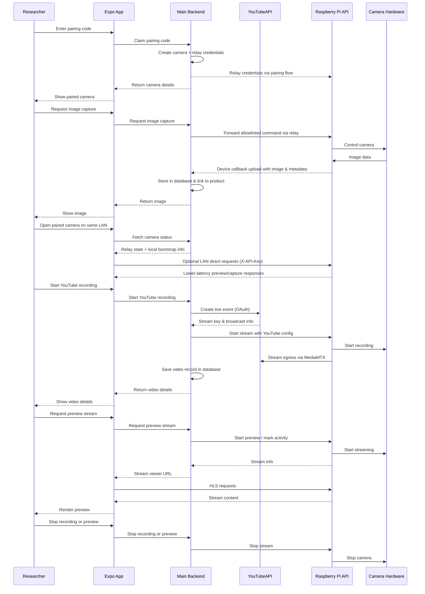

The optional RPi camera plugin connects camera devices to Relab for remote capture, HLS preview streaming, and YouTube streaming. The backend is the control plane and default relay path. When the camera and client share a LAN, the app can switch to direct local access for lower-latency preview and capture.

For setup and usage, see the [RPi camera user guide](../../user-guides/rpi-cam/). For endpoints, see the [API reference overview](/api-reference/). For device installation, see the [RPi camera plugin repository](https://github.com/CMLPlatform/relab-rpi-cam-plugin).

## System diagram


```mermaid
---
config:
    layout: elk
---
graph TD
    accTitle: RPi camera plugin system diagram
    accDescr: The Expo app calls the FastAPI backend, which relays commands to the RPi camera API over a WebSocket tunnel and receives HLS preview and image uploads back; the app can also reach the camera API directly over the LAN; the backend stores metadata in PostgreSQL, images in file storage, and session state in Redis, and coordinates YouTube streaming through Google OAuth.
    Researcher["Researcher"] -->|Capture workflow| FrontendApp["Expo app"]
    FrontendApp -->|API requests| MainAPI["FastAPI backend"]

    MainAPI -->|WebSocket relay| RpiCamAPI["RPi camera API"]
    FrontendApp -.->|LAN direct| RpiCamAPI
    RpiCamAPI -->|Controls| Camera["Camera hardware"]

    RpiCamAPI -->|HLS preview| FrontendApp
    RpiCamAPI -.->|Stream egress| YouTube["YouTube API"]
    RpiCamAPI -->|Image upload| MainAPI

    GoogleOAuth["Google OAuth"] -.->|User tokens| MainAPI
    MainAPI -.->|Livestream management| YouTube

    subgraph DataStores ["Data stores"]
        Database[("PostgreSQL")]
        FileStorage[("File storage")]
        Redis[("Redis")]
    end

    MainAPI -->|Metadata| Database
    MainAPI -->|Images| FileStorage
    MainAPI -->|Session state| Redis

    %% Diagram palette from assets/DESIGN.md (categorical ramp)
    classDef actor fill:#e3ecfa,stroke:#1f4c96,stroke-width:2px,color:#143567
    classDef frontend fill:#e0f2ed,stroke:#0e6b5e,stroke-width:1.5px,color:#0a4f45
    classDef backend fill:#f7ecd4,stroke:#8f6212,stroke-width:2px,color:#5c3f0a
    classDef datastore fill:#ede6f7,stroke:#6d4fa3,stroke-width:1.5px,color:#44337a
    classDef external fill:#f9e7de,stroke:#a8542f,stroke-width:1.5px,color:#6e371f
    classDef hardware fill:#fae4ec,stroke:#b0316e,stroke-width:2px,color:#6e2048
    classDef auth fill:#f1f4f8,stroke:#5a6675,stroke-width:1.5px,color:#16202e

    class Researcher actor
    class FrontendApp frontend
    class MainAPI backend
    class Database,FileStorage,Redis datastore

    class YouTube external
    class GoogleOAuth auth
    class RpiCamAPI,Camera hardware
```

## Interaction flow


```mermaid
sequenceDiagram
    accTitle: RPi camera pairing, capture, and streaming flow
    accDescr: Shows camera pairing through a claimed code, image capture relayed from the app through the backend to the camera and back, optional LAN-direct preview and capture once paired, YouTube live streaming started through backend-mediated OAuth, local HLS preview streaming, and how each flow is stopped.
    participant Researcher
    participant App as Expo App
    participant Backend as Main Backend
    participant YouTubeAPI
    participant RPiCamAPI as Raspberry Pi API
    participant Camera as Camera Hardware

    %% Camera Registration
    Researcher->>App: Enter pairing code
    App->>Backend: Claim pairing code
    Backend->>Backend: Create camera + relay credentials
    Backend-->>RPiCamAPI: Relay credentials via pairing flow
    Backend-->>App: Return camera details
    App-->>Researcher: Show paired camera

    %% Image Capture Flow
    Researcher->>App: Request image capture
    App->>Backend: Request image capture
    Backend->>RPiCamAPI: Forward allowlisted command via relay
    RPiCamAPI->>Camera: Control camera
    Camera->>RPiCamAPI: Image data
    RPiCamAPI-->>Backend: Device callback upload with image & metadata
    Backend->>Backend: Store in database & link to product
    Backend-->>App: Return image
    App-->>Researcher: Show image

    %% Optional Local Direct Mode
    Researcher->>App: Open paired camera on same LAN
    App->>Backend: Fetch camera status
    Backend-->>App: Relay state + local bootstrap info
    App->>RPiCamAPI: Optional LAN direct requests (X-API-Key)
    RPiCamAPI-->>App: Lower-latency preview/capture responses

    %% YouTube Streaming Flow
    Researcher->>App: Start YouTube recording
    App->>Backend: Start YouTube recording
    Backend->>YouTubeAPI: Create live event (OAuth)
    YouTubeAPI-->>Backend: Stream key & broadcast info
    Backend->>RPiCamAPI: Start stream with YouTube config
    RPiCamAPI->>Camera: Start recording
    RPiCamAPI->>YouTubeAPI: Stream egress via MediaMTX
    Backend->>Backend: Save video record in database
    Backend-->>App: Return video details
    App-->>Researcher: Show video details

    %% Local Preview Stream
    Researcher->>App: Request preview stream
    App->>Backend: Request preview stream
    Backend->>RPiCamAPI: Start preview / mark activity
    RPiCamAPI->>Camera: Start streaming
    RPiCamAPI-->>Backend: Stream info
    Backend-->>App: Stream viewer URL
    App->>RPiCamAPI: HLS requests
    RPiCamAPI-->>App: Stream content
    App-->>Researcher: Render preview

    %% Stop Streaming
    Researcher->>App: Stop recording or preview
    App->>Backend: Stop recording or preview
    Backend->>RPiCamAPI: Stop stream
    RPiCamAPI->>Camera: Stop camera
```

## Key design decisions

- Pairing, relay orchestration, capture storage, and YouTube coordination stay in the backend.
- Two contract layers: a public app-facing API and a smaller private device contract for pairing, relay, and uploads (see [Protocol boundaries](#protocol-boundaries)).
- After pairing, the app can switch to LAN-direct access with a device-local API key.
- Cameras pair through a short-lived code and receive runtime relay credentials from the backend. Operators do not copy long-lived API keys by hand.
- Captured images go to Relab's file storage, linked to the originating product or component record.
- YouTube streaming is optional. The backend's OAuth connection creates the broadcast; the device then streams directly to YouTube.

## Protocol boundaries

The plugin uses three contracts:

- **App REST API**: `/v1/plugins/rpi-cam/cameras/*` for app-facing camera CRUD, status, capture commands, telemetry, local-access bootstrap, and stream controls.
- **Device REST API**: `/v1/plugins/rpi-cam/device/cameras/*` for Pi-originated callbacks such as image upload, preview thumbnail upload, and self-unpair. These routes authenticate with short-lived device assertions rather than a user session.
- **Device WebSocket protocol**: `/v1/plugins/rpi-cam/ws/connect` for the persistent outbound relay tunnel from the Pi to the backend. It is not a browser endpoint: the Pi authenticates with a short-lived bearer device assertion, production pairing returns a `wss://` URL, browser `Origin` handshakes are rejected, WebSocket compression is disabled, and frame and queue sizes are bounded.

OpenAPI covers the HTTP routes; see the [API reference overview](/api-reference/). The WebSocket tunnel is not part of the generated REST clients.

### WebSocket relay envelope

The backend sends command envelopes to the device:

```json
{
  "id": "request-id",
  "method": "POST",
  "path": "/captures",
  "params": {},
  "body": {
    "product_id": 123,
    "description": "Front panel"
  },
  "headers": {}
}
```

The device replies with a matching response envelope. The shared `relab_rpi_cam_models` package owns the envelope schema and the relay allowlist; both the backend and the plugin enforce the allowlist.

Captured image bytes do not travel through the WebSocket. After a capture command succeeds, the Pi uploads the file and metadata directly to `/v1/plugins/rpi-cam/device/cameras/{camera_id}/image-upload`.

### Device callback routes

Pi-originated HTTP callbacks are namespaced to the camera plugin:

- `POST /v1/plugins/rpi-cam/device/cameras/{camera_id}/image-upload`
- `POST /v1/plugins/rpi-cam/device/cameras/{camera_id}/preview-thumbnail-upload`
- `DELETE /v1/plugins/rpi-cam/device/cameras/{camera_id}/self`
