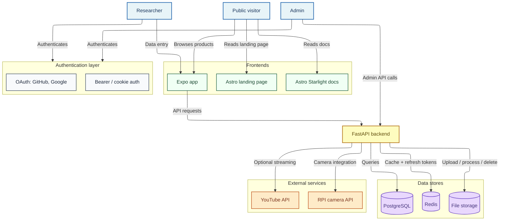

RELab is split into a research app, a public website, and backend services so each part can evolve without forcing every workflow into one interface.

## High-level architecture



## Monorepo structure

- `backend/`: main API, persistence, auth, file handling, and plugin integration
- `app/`: authenticated mobile-first data collection client built with Expo Router
- `www/`: landing page built with Astro
- `docs/`: documentation site
- Compose files at the repository root coordinate local and deployed multi-service setups

## Technology choices

- **Backend API**: FastAPI
- **Persistence layer**: SQLAlchemy 2.0 + Pydantic
- **Database**: PostgreSQL
- **Migrations**: Alembic
- **Caching and token infrastructure**: Redis
- **Research app frontend**: Expo / React Native
- **Public web frontend**: Astro
- **Docs site**: Astro Starlight

These choices keep the stack small enough to understand and operate without dedicated infrastructure work.

## Security architecture inventory

RELab is a single backend application with supporting infrastructure, not a large microservice fleet. Authorization stays in FastAPI route dependencies, ownership checks, and admin-only dependencies. Dedicated policy engines, service meshes, mTLS between containers, and internal identity-propagation tokens are deferred until there are multiple independently deployed backend services.

Application services are `api`, `app`, `www`, `docs`, `migrator`, and optional `backup`. Supporting systems are PostgreSQL, Redis, file or S3-compatible storage, Cloudflare Tunnel, optional Loki/OTLP telemetry, and external OAuth, email, Have I Been Pwned, and YouTube providers.

Sensitive data assets include accounts, profile/privacy settings, research records, uploaded media, OAuth and YouTube tokens, refresh-token state, RPi camera credentials, database dumps, backups, runtime secrets, and encryption keys. Public research records, request IDs, cache keys, and public camera key material are not application-encrypted secrets.

Trust boundaries are intentionally narrow: clients and devices enter through the API; Cloudflare fronts public ingress; PostgreSQL and Redis stay on the internal `data` network; runtime secrets stay in Docker secret files; and telemetry leaves the stack only when explicitly enabled. Main data flows are client-to-API requests, device assertions/uploads, backend reads and writes to Postgres/Redis/storage, OAuth/email/YouTube calls, backup reads from Postgres/uploads, and optional log/trace export.

## Backend domain structure

The backend is organised mainly by domain:

```sh
app/
├── api/
│   ├── auth/             # Login, registration, OAuth, users
│   ├── reference_data/   # Taxonomies, categories, materials, product types, units
│   ├── data_collection/  # Products, components, search, related properties
│   ├── file_storage/     # Uploaded files, images, linked media records
│   ├── plugins/          # Optional integrations such as rpi_cam
│   └── common/           # Shared routers, helpers, exceptions
├── core/                 # Runtime configuration, DB, cache, logging, HTTP clients
├── static/               # Static assets served by the backend
└── templates/            # Email and HTML templates
```

## Runtime behavior

At startup the backend:

- validates security-sensitive configuration
- initializes Redis and API caching
- creates storage directories for uploads
- mounts static and upload-backed routes
- prepares shared outbound HTTP clients
- starts background cleanup infrastructure

## Design priorities

- keep the data model explicit and inspectable
- support authenticated data entry from a dedicated app
- allow public and private API surfaces to coexist
- preserve a path toward dataset publication and external reuse
- keep identifiers and exports stable enough to link with other datasets
- avoid infrastructure complexity that isn't justified by the project scale
