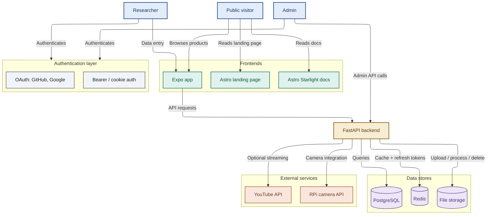

Relab is a research app, a public website, a docs site, and one backend.

## High-level architecture


```mermaid
---
config:
    layout: elk
    elk:
        nodePlacementStrategy: NETWORK_SIMPLEX
---

graph TD
    accTitle: Relab system architecture overview
    accDescr: Researchers and public visitors reach the Expo app, Astro landing page, and Starlight docs frontends; the Expo app and admins call the FastAPI backend, which authenticates through OAuth and bearer/cookie auth, reads and writes PostgreSQL and Redis, manages file storage, and integrates with the RPi camera API and YouTube API.
    Researcher["Researcher"] -->|Data entry| FrontendApp
    PublicUser["Public visitor"] -->|Browses products| FrontendApp
    PublicUser -->|Reads landing page| FrontendWeb
    PublicUser -->|Reads docs| Docs
    Admin["Admin"] -->|Admin API calls| Backend

    subgraph Frontends ["Frontends"]
        FrontendApp["Expo app"]
        FrontendWeb["Astro landing page"]
        Docs["Astro Starlight docs"]
    end

    FrontendApp -->|API requests| Backend
    Backend["FastAPI backend"]

    subgraph DataStores ["Data stores"]
        Redis[("Redis")]
        PostgreSQL[("PostgreSQL")]
        FileStorage[("File storage")]
    end

    Backend -->|Cache + refresh tokens| Redis
    Backend -->|Queries| PostgreSQL
    Backend -->|Upload / process / delete| FileStorage

    subgraph Auth ["Authentication layer"]
        OAuthProviders["OAuth: GitHub, Google"]
        AuthSystem["Bearer / cookie auth"]
    end

    Researcher -->|Authenticates| Auth
    Admin -->|Authenticates| Auth

    subgraph External ["External services"]
        RaspberryPi["RPi camera API"]
        YouTube["YouTube API"]
    end

    Backend -->|Camera integration| RaspberryPi
    Backend -->|Optional streaming| YouTube

    %% Diagram palette from assets/DESIGN.md (categorical ramp)
    classDef actor fill:#e3ecfa,stroke:#1f4c96,stroke-width:2px,color:#143567
    classDef frontend fill:#e0f2ed,stroke:#0e6b5e,stroke-width:1.5px,color:#0a4f45
    classDef backend fill:#f7ecd4,stroke:#8f6212,stroke-width:2px,color:#5c3f0a
    classDef datastore fill:#ede6f7,stroke:#6d4fa3,stroke-width:1.5px,color:#44337a
    classDef auth fill:#f1f4f8,stroke:#5a6675,stroke-width:1.5px,color:#16202e
    classDef external fill:#f9e7de,stroke:#a8542f,stroke-width:1.5px,color:#6e371f

    class Researcher,PublicUser,Admin actor
    class FrontendApp,FrontendWeb,Docs frontend
    class Backend backend
    class Redis,PostgreSQL,FileStorage datastore
    class OAuthProviders,AuthSystem auth
    class RaspberryPi,YouTube external
```

## Monorepo structure

- `backend/`: main API, persistence, auth, file handling, and plugin integration
- `app/`: authenticated mobile-first data collection client built with Expo Router
- `www/`: landing page built with Astro
- `docs/`: documentation site
- Compose files at the repository root coordinate local and deployed multi-service setups

## Technology choices

| Concern                          | Choice                    |
| -------------------------------- | ------------------------- |
| Backend API                      | FastAPI                   |
| Persistence layer                | SQLAlchemy 2.0 + Pydantic |
| Database                         | PostgreSQL                |
| Migrations                       | Alembic                   |
| Caching and token infrastructure | Redis                     |
| Research app frontend            | Expo / React Native       |
| Public web frontend              | Astro                     |
| Docs site                        | Astro Starlight           |

## Security architecture

Authorization lives in FastAPI route dependencies, public traffic enters through Cloudflare Tunnel, and PostgreSQL and Redis stay on internal networks. See [Security and hardening](/operations/security/) for the trust-boundary model and asset inventory.

## Backend domain structure

The backend is organized by domain:

```sh
app/
├── api/
│   ├── auth/             # Login, registration, OAuth, users
│   ├── reference_data/   # Taxonomies, categories, materials, product types, units
│   ├── data_collection/  # Products, components, search, related properties
│   ├── file_storage/     # Uploaded files, images, linked media records
│   ├── plugins/          # Optional integrations such as rpi_cam
│   ├── stats/            # Aggregate public totals, series, and category stats
│   ├── application/      # Use cases spanning domains: account erasure, public profiles
│   └── common/           # Shared routers, helpers, exceptions
├── core/                 # Runtime configuration, DB, cache, logging, HTTP clients
├── static/               # Static assets served by the backend
└── templates/            # Email and HTML templates
```

## Design priorities

- keep the data model explicit and inspectable
- support authenticated data entry from a dedicated app
- allow public and private API surfaces to coexist
- preserve a path toward dataset publication and external reuse
- keep identifiers and exports stable enough to link with other datasets
- avoid infrastructure the project scale does not justify

Relab is a modular monolith with explicit bounded contexts: identity and access, data collection,
reference data, media and storage, statistics, and device integration. It stays a monolith until a
real deployment or runtime boundary justifies a split.
