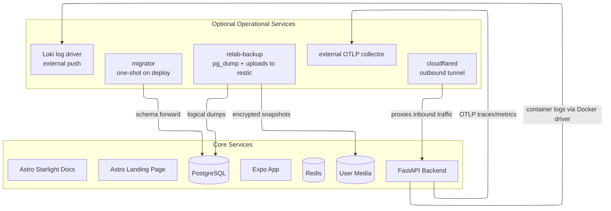

RELab runs as a self-hosted Docker Compose stack sized for a single VPS.

## Compose service topology

The deployed stack is defined entirely in Docker Compose. Core services run in all environments. Some deployments also enable additional operational services such as migrations, backups, the Cloudflare tunnel, and optional log/trace shipping to an external monitoring stack.



Backup services are enabled through Compose profiles. Telemetry is opt-in through host-level environment variables: `LOKI_URL` enables the optional Loki logging overlay, and `OTEL_EXPORTER_OTLP_ENDPOINT` enables backend OTLP export.

## Supported delivery path

- Docker Compose is the runtime for staging and production.
- `compose.yaml` is the shared base topology.
- `compose.dev.yaml`, `compose.ci.yaml`, and `compose.deploy.yaml` are the supported environment overlays.
- The same `compose.deploy.yaml` is used for prod and staging. Committed `deploy/env/*.compose.env` files select the environment; the host-level root `.env` holds only local interpolation values such as tunnel tokens, telemetry endpoints, backup paths, and optional offsite repositories.
- GitHub Actions validate changes, run security checks, and maintain release automation, but deploys are still operated from the server checkout.

Docker development and E2E ports bind to localhost by default. For Expo testing from another device over a LAN, run the Expo dev server directly from `app/` on the host instead of using the Docker app service.

The root `justfile` is the supported local interface for full-stack checks:

```bash
just setup
just ci
just test
just test-integration
just security
just docker-smoke
```

Focused subrepo work should use the subrepo `justfile`.

## Transport security

Production and staging are HTTPS-only behind Cloudflare Tunnel. Every deployed browser-facing origin emits:

```http
Strict-Transport-Security: max-age=63072000; includeSubDomains
```

Static frontends set this in Caddy; the API sets it from FastAPI in `prod` and `staging`. `preload` is intentionally omitted until the full `cml-relab.org` subdomain inventory is verified.

## Deploy flow

For a new host, clone the repo, create the root `.env`, create the backend runtime env file, then start the deploy stack and run migrations:

```bash
cp .env.example .env
cp backend/.env.prod.example backend/.env.prod
just deploy-secrets-template prod
# Replace every placeholder under secrets/prod/.
just prod-up YES
just prod-migrate YES
```

Staging follows the same pattern with the staging env files and `staging-*` recipes. Upgrades are intentionally boring: pull a known-good revision, bring the stack up again, run migrations, and verify `/live` and `/health`.

The database role hardening is a breaking fresh-volume change. For an existing host, take a verified dump first, stop the stack, recreate the Postgres volume, start Postgres so `/docker-entrypoint-initdb.d` creates the least-privilege roles, run migrations, then restore the dump through the migration/admin path.
For local rehearsal, use staging plus the backups profile instead of production: `just staging-up YES backups`, `just staging-migrate YES`, then `just backup-restore-smoke staging`.

## Denial-of-service controls

RELab keeps DoS mitigation layered. Cloudflare Tunnel is the public ingress path and should carry the network-level controls: WAF rules, per-path rate limiting for `/v1/auth/*`, `/v1/products/*/files`, `/v1/products/*/images`, `/v1/components/*/files`, `/v1/components/*/images`, `/v1/plugins/rpi-cam/device/cameras/*/image-upload`, `/v1/plugins/rpi-cam/device/cameras/*/preview-thumbnail-upload`, and `/v1/plugins/rpi-cam/ws/connect`, and request body limits aligned with the backend upload limits. Volumetric attacks are handled at Cloudflare or the upstream provider, not inside the FastAPI process.

The backend enforces source-controlled application limits: JSON bodies are counted while streaming, multipart uploads have per-media size caps and allowlisted formats, expensive public product suggestion/facet routes and upload routes use Redis-backed rate limits, and the RPi camera WebSocket relay bounds auth attempts and frame sizes. Keep those defaults in code unless product policy changes; the main deployment-sized Uvicorn knob is `UVICORN_LIMIT_CONCURRENCY`, which should be tuned with worker count, DB pool size, and host capacity.

## Storage and backups

- PostgreSQL stores the primary application state.
- Uploaded files and images are stored on disk and served by the backend.
- Database dumps and user-uploaded files are backed up into an encrypted local restic repository under `BACKUP_DIR`.
- Optional offsite copies use `restic copy`; WebDAV is supported through restic's rclone backend with `RESTIC_OFFSITE_REPOSITORY=rclone:<remote>:relab/<env>/restic`.
- Alembic migrations move schema state forward in a controlled way.
- `just backup-restore-smoke staging` or `just backup-restore-smoke prod` restores the latest database dump into a disposable Postgres container and verifies that it can be read.

The deploy stack runs app-owned services with dropped Linux capabilities, `no-new-privileges`, PID/file descriptor limits, and read-only root filesystems where supported. The backup container runs as UID/GID `1001`; make sure the host restic directory under `BACKUP_DIR` is writable by that ID.
CI checks Dockerfile misconfigurations with Trivy, while RELab-specific Compose policy checks validate rendered stack invariants such as network exposure, runtime hardening, image pinning, and secret access.

## Secrets and encrypted fields

Most RELab data is protected by access control, not application-level encryption. Passwords are hashed, not encrypted. Public research records, uploaded media, public RPI camera keys, request IDs, and cache keys are not application-encrypted.

The backend uses `DATA_ENCRYPTION_KEYS` only for reversible sensitive values it must recover later, such as OAuth provider tokens and active YouTube broadcast keys. Keep those keys in the host runtime environment, not in committed files. If key rotation becomes operationally necessary after production launch, add a focused re-encryption task then.

Database role passwords, the Redis password, the restic repository password, and optional rclone config live in gitignored Compose secret files under `secrets/<env>/`. The required secret filenames are listed in `deploy/required-secret-files.txt`; use `just deploy-secrets-template <env>` to create missing files and `just deploy-secrets-check` to verify that the manifest and Compose overlay stay aligned. The application role, migration role, and backup role are separate PostgreSQL users; the application role is not the schema owner.

Keep configuration ownership narrow: `deploy/` contains committed infrastructure config and manifests, `secrets/` contains uncommitted operator-owned secret material, and `scripts/` contains repo-wide operational helpers that are too large for the root `justfile`. Backend runtime settings stay in `backend/.env.<env>` because they are consumed directly by the FastAPI settings layer and backend tooling.

In the current single-host deployment, PostgreSQL and Redis are isolated on the internal Compose `data` network and do not publish host ports in prod or staging. `DATABASE_SSL=false` is intentional for this trusted local Docker network. If PostgreSQL moves to an external host, managed database, or untrusted network, enable `DATABASE_SSL` and manage database TLS certificates as part of that move.

If a real secret is exposed outside the intended host, rotate it and treat existing encrypted backups as still depending on the old key until the backup retention window passes.

## Quality controls

- backend: unit and integration tests, linting, and type checking
- app: Jest tests for app logic and UI components
- www: Vitest and Playwright coverage for the public site
- docs: formatting, spelling checks, and build smoke tests

The repository also includes dependency maintenance, container scanning, performance baselines, and repository-level checks through GitHub Actions.

## Supply chain artifacts

GitHub Dependency Review / Dependency Graph gates dependency changes, while Renovate opens dependency update PRs. For an explicit full-tree dependency vulnerability sweep, run `just audit`. The security workflow builds the deployable Compose images, scans them with Trivy, and stores SPDX JSON SBOM artifacts for 90 days.

When Release Please creates a GitHub release, the release workflow rebuilds those images, generates SPDX SBOM files, attests the SBOM files with GitHub artifact attestations, and uploads them as release assets. RELab deploys locally built Compose images rather than immutable registry images, so release attestations prove SBOM file provenance. Image-digest-bound SBOM attestations require publishing runtime images to a registry.

## Telemetry

Prod and staging can ship logs, traces, and metrics to a central monitoring stack outside this repo. Dev and CI do not ship telemetry.

- `LOKI_URL` in the host root `.env` enables the optional Loki Docker log-driver overlay.
- `OTEL_EXPORTER_OTLP_ENDPOINT` enables backend OTLP traces and metrics.
- `OTEL_EXPORTER_OTLP_HEADERS` can pass collector auth headers through to the backend container.

Hosts without those variables keep the simpler local-only behavior. Keep monitoring endpoints private through a tunnel or private network; do not expose the monitoring stack directly to the public internet.

## Operational considerations

- Redis is used both for caching and parts of the authentication and token flow. Partial Redis outages have user-facing effects.
- Uploaded media is part of the research record and should be treated as primary data, not as disposable assets.
- Production secrets and origin/host configuration matter; the backend enforces stricter checks outside development.
- Telemetry is optional. When enabled, the backend exports OTLP traces and metrics to an external collector, while Docker ships container logs to Loki through the optional overlay.
- The Compose-based setup is easy to reason about, but scaling and secret rotation are less automated than in a larger platform setup. That trade-off is deliberate.
