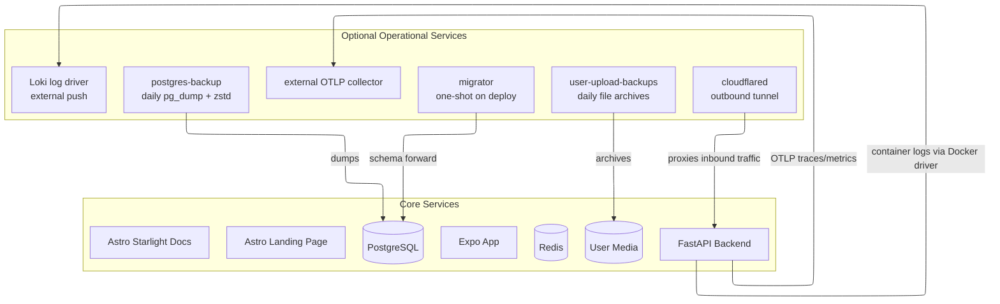

RELab runs as a self-hosted Docker Compose stack sized for a single VPS.

## Compose service topology

The deployed stack is defined entirely in Docker Compose. Core services run in all environments. Some deployments also enable additional operational services such as migrations, backups, the Cloudflare tunnel, and optional log/trace shipping to an external monitoring stack.



Backup services are enabled through Compose profiles. Telemetry is opt-in through host-level environment variables: `LOKI_URL` enables the optional Loki logging overlay, and `OTEL_EXPORTER_OTLP_ENDPOINT` enables backend OTLP export.

## Supported delivery path

- Docker Compose is the runtime for staging and production.
- `compose.yaml` is the shared base topology.
- `compose.dev.yaml`, `compose.ci.yaml`, and `compose.deploy.yaml` are the supported environment overlays.
- The same `compose.deploy.yaml` is used for prod and staging. Host-level `.env` values and committed `.env.<env>.compose` files select the environment.
- GitHub Actions validate changes, run security checks, and maintain release automation, but deploys are still operated from the server checkout.

The root `justfile` is the supported local interface for full-stack checks:

```bash
just setup
just ci
just test
just test-integration
just security
just docker-smoke
```

Focused subrepo work should use the subrepo `justfile`.

## Deploy flow

For a new host, clone the repo, create the root `.env`, create the backend runtime env file, then start the deploy stack and run migrations:

```bash
cp .env.example .env
cp backend/.env.prod.example backend/.env.prod
just prod-up YES
just prod-migrate YES
```

Staging follows the same pattern with the staging env files and `staging-*` recipes. Upgrades are intentionally boring: pull a known-good revision, bring the stack up again, run migrations, and verify `/live` and `/health`.

## Storage and backups

- PostgreSQL stores the primary application state.
- Uploaded files and images are stored on disk and served by the backend.
- Database dumps and user-uploaded files are backed up regularly to cloud storage.
- Alembic migrations move schema state forward in a controlled way.

## Secrets and encrypted fields

Most RELab data is protected by access control, not application-level encryption. Passwords are hashed, not encrypted. Public research records, uploaded media, public RPI camera keys, request IDs, and cache keys are not application-encrypted.

The backend uses `DATA_ENCRYPTION_KEYS` only for reversible sensitive values it must recover later, currently OAuth provider tokens and active YouTube broadcast keys. Keep those keys in the host runtime environment, not in committed files. If key rotation becomes operationally necessary after production launch, add a focused re-encryption task then.

If a real secret is exposed outside the intended host, rotate it and treat existing encrypted backups as still depending on the old key until the backup retention window passes.

## Quality controls

- backend: unit and integration tests, linting, and type checking
- frontend-app: Jest tests for app logic and UI components
- frontend-web: Vitest and Playwright coverage for the public site
- docs: formatting, spelling checks, and build smoke tests

The repository also includes dependency maintenance, container scanning, performance baselines, and repository-level checks through GitHub Actions.

## Telemetry

Prod and staging can ship logs, traces, and metrics to a central monitoring stack outside this repo. Dev and CI do not ship telemetry.

- `LOKI_URL` in the host root `.env` enables the optional Loki Docker log-driver overlay.
- `OTEL_EXPORTER_OTLP_ENDPOINT` enables backend OTLP traces and metrics.
- `OTEL_EXPORTER_OTLP_HEADERS` can pass collector auth headers through to the backend container.

Hosts without those variables keep the simpler local-only behavior. Keep monitoring endpoints private through a tunnel or private network; do not expose the monitoring stack directly to the public internet.

## Operational considerations

- Redis is used both for caching and parts of the authentication and token flow. Partial Redis outages have user-facing effects.
- Uploaded media is part of the research record and should be treated as primary data, not as disposable assets.
- Production secrets and origin/host configuration matter; the backend enforces stricter checks outside development.
- Telemetry is optional. When enabled, the backend exports OTLP traces and metrics to an external collector, while Docker ships container logs to Loki through the optional overlay.
- The Compose-based setup is easy to reason about, but scaling and secret rotation are less automated than in a larger platform setup. That trade-off is deliberate.
