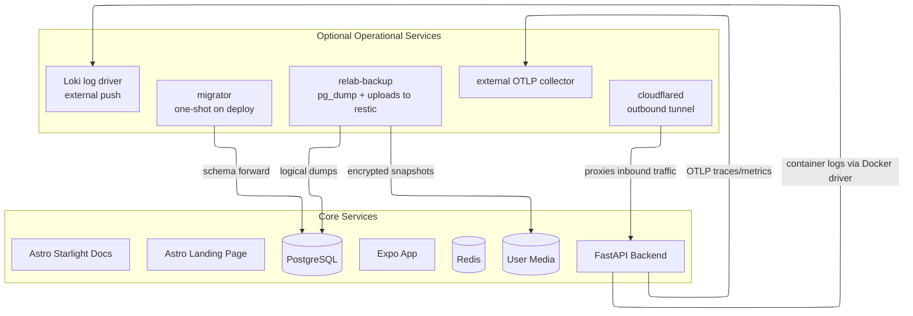

RELab runs as a self-hosted Docker Compose stack sized for a single VPS.

## Compose service topology

The deployed stack is defined entirely in Docker Compose. Core services run in all environments. Some deployments also enable additional operational services such as migrations, backups, the Cloudflare tunnel, and optional log/trace shipping to an external monitoring stack.



Backup services are enabled through Compose profiles. Telemetry is opt-in through host-level environment variables: `LOKI_URL` enables the optional Loki logging overlay, and `OTEL_EXPORTER_OTLP_ENDPOINT` enables backend OTLP export.

## Supported delivery path

- Docker Compose is the runtime for staging and production.
- `compose.yaml` is the shared base topology.
- `compose.dev.yaml`, `compose.ci.yaml`, and `compose.deploy.yaml` are the supported environment overlays.
- The same `compose.deploy.yaml` is used for prod and staging. Committed `deploy/env/*.compose.env` files select the environment, public origins, and worker count once; Compose maps those values to backend, app, docs, and www variable names at each service boundary. Docker Compose reads the host-level root `.env` for host-local operator inputs such as tunnel tokens, OAuth client IDs, email sender metadata, the initial superuser identity, telemetry endpoints, and backup paths. Manual shell helpers use exported environment variables instead of parsing `.env`.
- GitHub Actions validate changes, run security checks, and maintain release automation, but deploys are still operated from the server checkout.
- Cloudflare DNS and Tunnel public hostname configuration lives in `infra/cloudflare/`. Compose still owns the runtime services; OpenTofu owns only the public edge.

Docker development and E2E ports bind to localhost by default. For Expo testing from another device over a LAN, run the Expo dev server directly from `app/` on the host instead of using the Docker app service.

The root `justfile` is the supported local interface for full-stack checks:

```bash
just setup
just ci
just test
just test-integration
just security
just docker-smoke
```

Focused subrepo work should use the subrepo `justfile`.

## Cloudflare edge as code

RELab manages public hostnames through OpenTofu in `infra/cloudflare/`. The
configuration is intentionally narrow: DNS records, separate prod/staging
Cloudflare Tunnels, Tunnel ingress rules, and a final `http_status:404` catch-all
for unknown hostnames. It does not manage app secrets, Compose services,
PostgreSQL, Redis, storage, backups, or host deployment.

The current origins point at Compose services such as `http://api:8000` and
`http://app:8081`. If RELab later moves to Kubernetes or cloud-managed
containers, keep the public hostname map stable and replace the origin targets
with Kubernetes service names, internal load balancers, or other private origins.

Use separate prod and staging OpenTofu workspaces/state. Before applying this to
an existing Cloudflare account, import the current DNS records and tunnels, then
run `just cloudflare-plan staging` or `just cloudflare-plan prod` until the plan
shows only intentional drift. Apply with `just cloudflare-apply <env> YES` after
reviewing the plan. Provide Cloudflare/OpenTofu credentials through environment
variables; today those can be exported manually, and later they can come from a
department-owned password manager. Do not commit Cloudflare tokens, tunnel
tokens, or state files.

Public hostname changes should start in `infra/cloudflare/`. Do not add wildcard
DNS records unless there is a concrete operational need and the blast radius has
been reviewed.

## Network segmentation policy

The deploy stack keeps segmentation intentionally small: public-facing services use the `edge` network, data services use the internal `data` network, and only the API bridges both. This follows the OWASP network segmentation model at Compose scale without adding extra proxies, VLANs, or host firewall rules to the repo.

| Service group | Compose networks | Host ports in prod/staging |
| --- | --- | --- |
| `cloudflared`, `docs`, `app`, `www` | `edge` only | none |
| `api` | `edge`, `data` | none |
| `postgres`, `redis`, `migrator`, `backup` | `data` only | none |

`just compose-config` validates that the supported Compose overlays render for dev, prod, and staging.
`just deploy-secrets-check` validates that rendered Compose secrets point at the expected `secrets/<env>/` files.

## Transport security

Production and staging are HTTPS-only behind Cloudflare Tunnel. The Cloudflare
edge configuration in `infra/cloudflare/` enforces TLS 1.2 or newer, enables TLS
1.3, redirects HTTP requests to HTTPS before they reach the tunnel, and owns
RELab-specific Cloudflare rate limiting policy for auth, upload, and RPi camera
traffic.

Every deployed browser-facing origin emits:

```http
Strict-Transport-Security: max-age=63072000; includeSubDomains
```

Static frontends set this in Caddy; the API sets it from FastAPI in `prod` and `staging`. `preload` is intentionally omitted until the full `cml-relab.org` subdomain inventory is verified.

## Deploy flow

For a new host, clone the repo, create the root `.env`, review the relevant `deploy/env/*.compose.env` file, create secret files, validate the render, then start the deploy stack and run migrations:

```bash
cp .env.example .env
# Fill required values in .env.
just deploy-secrets-template prod
# Replace every placeholder under secrets/prod/.
just compose-config
just deploy-secrets-check
just prod-up YES
just prod-migrate YES
```

Staging follows the same pattern with the staging env files and `staging-*` recipes. Upgrades are intentionally boring: pull a known-good revision, bring the stack up again, run migrations, and verify `/live` and `/health`.

The database role hardening is a breaking fresh-volume change. For an existing host, take a verified dump first, stop the stack, recreate the Postgres volume, start Postgres so `/docker-entrypoint-initdb.d` creates the least-privilege roles, run migrations, then restore the dump through the migration/admin path.
For local rehearsal, use staging plus the backups profile instead of production: `just staging-up YES backups`, `just staging-migrate YES`, then `just backup-restore-smoke staging`.

## Denial-of-service controls

RELab keeps DoS mitigation layered. Cloudflare Tunnel is the public ingress path and carries source-controlled edge controls in `infra/cloudflare/`: per-path rate limiting for `/v1/auth/*`, product/component media uploads, RPi camera image/thumbnail uploads, and `/v1/plugins/rpi-cam/ws/connect`. Volumetric attacks are handled at Cloudflare or the upstream provider, not inside the FastAPI process. Managed WAF rules can be added later once the zone plan and existing dashboard state are known.

The backend enforces source-controlled application limits: JSON bodies are counted while streaming, multipart uploads have per-media size caps and allowlisted formats, expensive public product suggestion/facet routes and upload routes use Redis-backed rate limits, and the RPi camera WebSocket relay bounds auth attempts and frame sizes. Keep those defaults in code unless product policy changes; tune deployment capacity primarily with `WEB_CONCURRENCY`, DB pool sizing, and host resources.

## Storage and backups

- PostgreSQL stores the primary application state.
- Uploaded files and images are stored on disk and served by the backend.
- Database dumps and user-uploaded files are backed up into an encrypted local restic repository under `BACKUP_DIR`.
- Optional offsite copies use `restic copy`; WebDAV is supported through restic's rclone backend. Export `RESTIC_OFFSITE_REPOSITORY=rclone:<remote>:relab/<env>/restic` before running the manual offsite-copy helper.
- Alembic migrations move schema state forward in a controlled way.
- `just backup-restore-smoke staging` or `just backup-restore-smoke prod` restores the latest database dump into a disposable Postgres container and verifies that it can be read.

The deploy stack runs app-owned services with dropped Linux capabilities, `no-new-privileges`, PID/file descriptor limits, and read-only root filesystems where supported. The backup container runs as UID/GID `1001`; make sure the host restic directory under `BACKUP_DIR` is writable by that ID.
CI checks Dockerfile misconfigurations with Trivy and validates Cloudflare edge IaC with `just cloudflare-check`.
Root deployment validation renders the supported Compose overlays with `just compose-config` and checks rendered secret file paths with `just deploy-secrets-check`.

## Secrets and encrypted fields

Most RELab data is protected by access control, not application-level encryption. Passwords are hashed, not encrypted. Public research records, uploaded media, public RPI camera keys, request IDs, and cache keys are not application-encrypted.

`deploy/env/variables.toml` is the source-controlled inventory for variables and secrets. It classifies each name as committed non-secret deploy identity, host-local input, backend dev fixture, or runtime secret file, and records the consumer and future Infisical path for runtime secrets. Use `just env-inventory` from the repo root when onboarding a host or reviewing a configuration change.

The backend uses `DATA_ENCRYPTION_KEY` only for reversible sensitive values it must recover later, such as OAuth provider tokens and active YouTube broadcast keys. Cache payload signing uses the separate `CACHE_SIGNING_SECRET`, and OAuth state uses `OAUTH_STATE_SECRET`, so each key has one purpose. Keep these application secrets in gitignored Compose secret files under `secrets/<env>/`, not in committed files or backend env files.

Backend app secrets, database role passwords, the Redis password, the restic repository password, and optional rclone config live in gitignored Compose secret files under `secrets/<env>/`. Required files are declared by the rendered Compose overlays; use `just deploy-secrets-template dev`, `just deploy-secrets-template staging`, or `just deploy-secrets-template prod` to create missing files and `just deploy-secrets-check` to verify that Compose points at the expected root secret files. The application role, migration role, and backup role are separate PostgreSQL users; the application role is not the schema owner.

Keep configuration ownership narrow: `infra/cloudflare/` contains public edge
configuration, `deploy/` contains committed non-secret runtime identity, the
root `.env` contains host-local operator inputs, `secrets/`
contains uncommitted operator-owned secret material, and `scripts/` contains
repo-wide operational helpers that are too large for the root `justfile`.
Backend dotenv files are local/test fixtures only; prod and staging do not use
backend `.env.<env>` files.

In the current single-host deployment, PostgreSQL and Redis are isolated on the internal Compose `data` network and do not publish host ports in prod or staging. `DATABASE_SSL=false` is intentional for this trusted local Docker network. If PostgreSQL moves to an external host, managed database, or untrusted network, enable `DATABASE_SSL` and manage database TLS certificates as part of that move.

To rotate a secret, replace its file under `secrets/<env>/`, restart the affected service, and verify `/live` and `/health`. If a real secret is exposed outside the intended host, rotate it and treat existing encrypted backups as still depending on the old key until the backup retention window passes.

## Quality controls

- backend: unit and integration tests, linting, and type checking
- app: Jest tests for app logic and UI components
- www: Vitest and Playwright coverage for the public site
- docs: formatting, spelling checks, and build smoke tests

The repository also includes dependency maintenance, container scanning, performance baselines, and repository-level checks through GitHub Actions.

## Supply chain artifacts

GitHub Dependency Review / Dependency Graph gates dependency changes, while Renovate opens dependency update PRs. For an explicit full-tree dependency vulnerability sweep, run `just audit`. The security workflow builds the deployable Compose images, scans them with Trivy, and stores SPDX JSON SBOM artifacts for 90 days.

When Release Please creates a GitHub release, the release workflow rebuilds those images, generates SPDX SBOM files, attests the SBOM files with GitHub artifact attestations, and uploads them as release assets. RELab deploys locally built Compose images rather than immutable registry images, so release attestations prove SBOM file provenance. Image-digest-bound SBOM attestations require publishing runtime images to a registry.

## Browser third-party JavaScript

RELab does not load third-party browser runtime JavaScript by default. Browser code is installed, bundled, and served as first-party assets; Biome and the repository pre-commit/CI Semgrep policy block remote script tags, remote module imports, CDN-hosted runtime assets, and common analytics/tag-manager snippets.

The current exception is product video embedding from `https://www.youtube-nocookie.com`, constrained by CSP and iframe/WebView origin controls. Any new third-party runtime script must be intentionally reviewed, documented, allowlisted in CSP, and covered by the browser JavaScript policy tests.

## Telemetry

Prod and staging can ship logs, traces, and metrics to a central monitoring stack outside this repo. Dev and CI do not ship telemetry.

- `LOKI_URL` in the host root `.env` enables the optional Loki Docker log-driver overlay.
- `OTEL_EXPORTER_OTLP_ENDPOINT` enables backend OTLP traces and metrics.
- `OTEL_EXPORTER_OTLP_HEADERS` can pass collector auth headers through to the backend container.

Hosts without those variables keep the simpler local-only behavior. Keep monitoring endpoints private through a tunnel or private network; do not expose the monitoring stack directly to the public internet.

## Operational considerations

- Redis is used both for caching and parts of the authentication and token flow. Partial Redis outages have user-facing effects.
- Uploaded media is part of the research record and should be treated as primary data, not as disposable assets.
- Production secrets and origin/host configuration matter; the backend enforces stricter checks outside development.
- Telemetry is optional. When enabled, the backend exports OTLP traces and metrics to an external collector, while Docker ships container logs to Loki through the optional overlay.
- The Compose-based setup is easy to reason about, but scaling and secret rotation are less automated than in a larger platform setup. That trade-off is deliberate.
