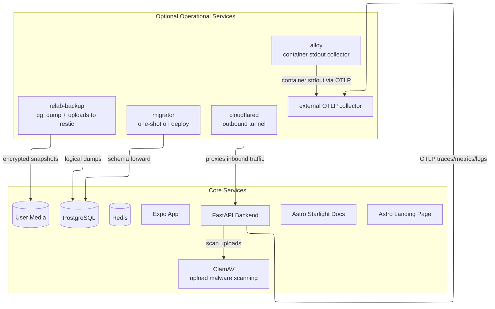

Relab runs as a self-hosted Docker Compose stack sized for a single VPS. This page is the
reference for how that stack is put together. For the step-by-step procedure, see
[Installation and self-hosting](/operations/install/#production-and-staging-deployment).

## Compose service topology

Docker Compose defines the whole stack. Core services run in every environment; migrations, backups, the Cloudflare tunnel, and telemetry shipping are optional operational services.


```mermaid
---
config:
    layout: elk
---
graph TD
    accTitle: Deployment Compose service topology
    accDescr: The core services are the FastAPI backend, PostgreSQL, Redis, ClamAV, user media storage, the Expo app, the Astro landing page, and the Starlight docs site. They run alongside optional operational services for migrations, backups, the Cloudflare tunnel, and OTLP telemetry export from both the backend and an Alloy log collector. The backend is the hub, talking to the database, cache, malware scanner, and external monitoring collector.
    subgraph Core ["Core Services"]
        Backend[FastAPI Backend]
        DB[(PostgreSQL)]
        Cache[(Redis)]
        ClamAV[ClamAV\nupload malware scanning]
        Uploads[(User Media)]
        FrontendApp[Expo App]
        FrontendWeb[Astro Landing Page]
        Docs[Astro Starlight Docs]
    end

    subgraph Operational ["Optional Operational Services"]
        Migrations[migrator\none-shot on deploy]
        Backups[relab-backup\npg_dump + uploads to restic]
        Cloudflared[cloudflared\noutbound tunnel]
        Alloy[alloy\ncontainer stdout collector]
        OTel[external OTLP collector]
    end

    Migrations -->|schema forward| DB
    Backups -->|logical dumps| DB
    Backups -->|encrypted snapshots| Uploads
    Cloudflared -->|proxies inbound traffic| Backend
    Backend -->|scan uploads| ClamAV
    Backend -->|OTLP traces/metrics/logs| OTel
    Alloy -->|container stdout via OTLP| OTel
```

Compose profiles enable the backup services. `OTEL_EXPORTER_OTLP_ENDPOINT` enables the backend's OTLP export and includes the Alloy overlay that ships every other container's stdout.

## Supported delivery path

- Docker Compose is the runtime for staging and production.
- `compose.yaml` is the shared base topology.
- `compose.dev.yaml`, `compose.ci.yaml`, and `compose.deploy.yaml` are the supported environment overlays.
- Prod and staging share `compose.deploy.yaml`; the `prod-*` and `staging-*` recipes select which. The root `.env` supplies everything host-local: the public origins, the tunnel token, OAuth client IDs, email sender metadata, the initial superuser identity, telemetry endpoints, and backup paths. One host serves one environment; the deploy recipes refuse a mismatch. Manual shell helpers read exported environment variables, not `.env`.
- GitHub Actions validate changes, run security checks, and maintain release automation. Deploys run from the server checkout.
- Cloudflare DNS and Tunnel hostnames live in `infra/cloudflare/`. OpenTofu owns only the public edge; Compose owns the runtime services.

Docker development and E2E ports bind to localhost by default. To test Expo from another device over a LAN, run the Expo dev server from `app/` on the host instead of the Docker app service.

The root `justfile` runs full-stack checks:

```bash
just setup
just ci
just test
just test-integration
just security
just docker-smoke
```

For focused subrepo work, use the subrepo `justfile`.

## Cloudflare edge as code

OpenTofu in `infra/cloudflare/` manages DNS records, separate prod and staging Cloudflare
Tunnels, Tunnel ingress rules, and a final `http_status:404` catch-all for unknown hostnames. It
does not manage app secrets, Compose services, PostgreSQL, Redis, storage, backups, or host
deployment.

Origins point at Compose services such as `http://api:8000` and `http://app:8081`.

Prod and staging have separate OpenTofu workspaces and state. Start public hostname changes in
`infra/cloudflare/`. Do not add wildcard DNS records without a concrete operational need and a
blast-radius review. The plan and apply procedure is in the
[install guide](/operations/install/#production-and-staging-deployment).

## Network segmentation policy

Public-facing services use the `edge` network, data services the internal `data` network, and upload scanning the private `scanning` network. Only the API bridges networks. The repo adds no proxies, VLANs, or host firewall rules.

| Service group | Compose networks | Host ports in prod/staging |
| --- | --- | --- |
| `cloudflared`, `docs`, `app`, `www` | `edge` only | none |
| `api` | `edge`, `data`, `scanning` | none |
| `postgres`, `redis`, `migrator`, `backup` | `data` only | none |
| `clamav` (`scanning` profile only) | `scanning` only | none |

`just compose-config` validates that the supported Compose overlays render for dev, prod, and staging.
`just deploy-secrets-check` validates the rendered secret files (paths, modes, no placeholders) and that the telemetry variables are set together.

## Backend egress

Backend outbound HTTP is restricted to `OUTBOUND_HTTP_ALLOWED_URLS`. See
[Security and hardening](/operations/security/#backend-egress) for the policy
model.

## Transport security

Production and staging are HTTPS-only behind Cloudflare Tunnel. The Cloudflare
edge configuration in `infra/cloudflare/` enforces TLS 1.2 or newer, enables TLS
1.3, redirects HTTP requests to HTTPS before they reach the tunnel, and owns
Relab-specific Cloudflare rate limiting policy for auth, upload, and RPi camera
traffic.

Every deployed browser-facing origin emits:

```http
Strict-Transport-Security: max-age=63072000; includeSubDomains
```

Static frontends set it in Caddy; the API sets it from FastAPI in `prod` and `staging`. `preload` is omitted because the full `cml-relab.org` subdomain inventory has not been verified for preloading.

PostgreSQL and Redis stay on the private Compose `data` network, so `DATABASE_TLS=false` and
`REDIS_TLS=false` are the defaults. If either service moves off that network, set
`DATABASE_TLS=true` or `REDIS_TLS=true`, and set the matching CA file variable for a private CA.
See [Security and hardening](/operations/security/) for the trust-boundary model.

Supported browsers must implement HTTPS, HSTS, Content Security Policy, host-prefixed secure cookies, SameSite cookies, CORS preflight enforcement, `Cross-Origin-Opener-Policy`, and `Cross-Origin-Resource-Policy`. There is no fallback security mode: unsupported browsers may fail to authenticate, fail to load protected media, or be blocked by browser policy.

## Storage and backups

- PostgreSQL stores the primary application state.
- Uploaded files and images are stored on disk and served by the backend.
- Database dumps and user-uploaded files are backed up into an encrypted local restic repository under `BACKUP_HOST_DIR`. The backup container runs as UID/GID `65532`.
- Backups are host systemd timers, not Compose services. The hourly job takes a snapshot (`relab-backup@.timer`). The daily job runs retention, the integrity check, and the optional offsite copy (`relab-backup-maintenance@.timer`), so the repository is repacked once a day, not 24 times. Losing the host still costs up to a day of data.
- Offsite copies use `restic copy` over restic's rclone backend, to the one remote defined in `secrets/<env>/rclone.conf`.
- A backup refuses to archive a dump smaller than half the newest stored snapshot, because an empty dump would otherwise become the newest snapshot and age out the good copies. `RESTIC_MIN_DUMP_RATIO` tunes it; `0` disables it.
- Alembic migrations move schema state forward one transaction per revision, so a failed migration leaves the last successful revision in place and a re-run resumes from there. `just <env>-rollback YES <sha> [<revision>]` returns to the images a previous build tagged, and downgrades the schema only when no migration in the range destroyed data; otherwise restore a backup.
- `just restore-check <env>` restores the latest database dump into a disposable Postgres container and verifies that it can be read.

App-owned services run with dropped Linux capabilities, `no-new-privileges`, PID and file descriptor limits, and read-only root filesystems where supported. CI checks Dockerfiles with Trivy and validates the Cloudflare edge IaC with `just cloudflare-check`.

## Secrets and encrypted fields

Access control, not application-level encryption, protects most Relab data. Passwords are hashed. Public research records, uploaded media, public RPi camera keys, request IDs, and cache keys are not application-encrypted.

`deploy/env/variables.toml` is the source-controlled runtime secret inventory: the secret files Compose renders under `secrets/<env>/`, plus the future Infisical path template. Run `just env-inventory` from the repo root when onboarding a host or reviewing secret-file changes.

`DATA_ENCRYPTION_KEY` encrypts only values the backend must recover later, such as OAuth provider tokens and active YouTube broadcast keys. `CACHE_SIGNING_SECRET` signs cache payloads and `OAUTH_STATE_SECRET` signs OAuth state; each key has one purpose.

Backend app secrets, database role passwords, the Redis password, the restic repository password, and optional rclone config live in gitignored Compose secret files under `secrets/<env>/`, never in committed files or backend env files. The rendered Compose overlays declare the required files.

The application, migration, and backup roles are separate PostgreSQL users; the application role does not own the schema. `just stack prod up` and `just stack staging up` run `deploy/postgres/initdb/provision.sh` against the live database before starting the API: it creates the roles, transfers table ownership to the migration role, and installs the superuser-only extensions. The same script runs from `/docker-entrypoint-initdb.d` on an empty volume, so an existing volume needs no rebuild.

Configuration ownership: `infra/cloudflare/` holds public edge configuration, `deploy/` committed
non-secret runtime identity, the root `.env` host-local operator inputs, `secrets/` uncommitted
secret material, and `scripts/` repo-wide operational helpers too large for the root `justfile`.
Backend dotenv files are local and test inputs only; prod and staging do not use backend
`.env.<env>` files.

### Rotation and break-glass

To rotate an app secret, replace the file under `secrets/<env>/`, restart the affected service, and verify `/live` and `/health`. Rotating `AUTH_TOKEN_SECRET` invalidates existing login, reset, and verification tokens. For OAuth or email provider secrets, rotate the upstream credential first, update the matching file, then restart `api`.

To rotate a database role password, change the PostgreSQL role password, then update the matching file under `secrets/<env>/` and restart the affected service (`api`, `migrator`, or `backup`). Redis rotation requires restarting `redis` and its consumers such as `api`.

`DATA_ENCRYPTION_KEY` is break-glass material. Older encrypted values and backups depend on the previous key, so rotating it needs a planned re-encryption path and a backup-retention review.

If a secret leaks outside the intended host, treat it as compromised: revoke or rotate it upstream, update the host file or root `.env` value, restart affected services, run health checks, and record what was exposed and when. Existing encrypted backups depend on the old key until their retention window passes.

## Telemetry

Prod and staging can ship logs, traces, and metrics to a central monitoring stack outside this repo. Dev and CI ship nothing.

- `OTEL_EXPORTER_OTLP_ENDPOINT` switches on the whole path: the backend's OTLP traces, metrics, and logs, plus the `compose.telemetry.yml` overlay.
- `OTLP_AUTH_TOKEN` is the collector's bearer token. Compose folds it into the SDK's header format for the backend; Alloy reads it directly.
- `TELEMETRY_EDGE_KEY` is a second credential the edge in front of the collector expects. All three must be set together; `just deploy-secrets-check` enforces this.
- `OTEL_EXPORTER_OTLP_PROTOCOL` defaults to `http/protobuf`; the collector sits behind a tunnel that routes HTTPS only.

Hosts without these variables ship nothing. Keep monitoring endpoints behind a tunnel or private network; never expose the monitoring stack to the public internet.

The Alloy overlay ships container stdout from every other service and host metrics (CPU, memory, load, disk, network, `hwmon` temperatures). Alloy never touches the Docker socket: a `docker-socket-proxy` container holds it and exposes only the read-only endpoints discovery and log tailing need, with POST refused. Alloy mounts the host's `/proc`, `/sys`, and `/` read-only for node metrics, running as root with capabilities dropped to `SYSLOG` and `DAC_READ_SEARCH`. On a host with an NVIDIA card, `GPU_METRICS=1` adds `compose.telemetry.gpu.yml` and GPU metrics under the same `host_name`.

## Operational considerations

- Redis serves caching and parts of the authentication and token flow. Partial Redis outages have user-facing effects.
- Uploaded media is primary research data, not a disposable asset.
- The backend enforces stricter secret, origin, and host checks outside development.
- With telemetry enabled, no Loki push hostname is exposed; Loki has no authentication of its own.
- Scaling and secret rotation are manual; the Compose setup trades automation for a single VPS.
- Scheduled work (hourly backup, daily backup maintenance, hourly watchdog, monthly restore check) runs from systemd timers, which catch up on runs missed while the host was off. Each job pings a per-job dead-man's switch that bypasses the telemetry collector, so it still reports when the telemetry path itself is broken. `just watchdog <env>` is the local triage command; it exits non-zero with an `ALERT[...]` line per failure.
